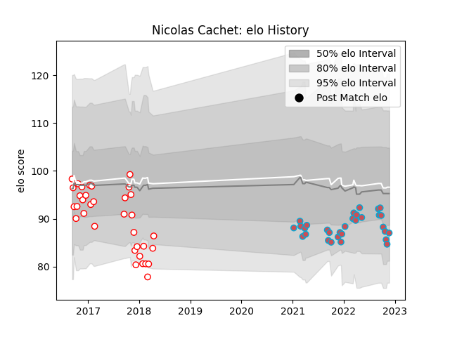

---  
layout: page  
title: Nicolas Cachet  
date: 2022-12-09 13:10:51.657225  
categories: player  
---
# Nicolas Cachet

## Positions: FB, FH

## Current elo: 89.0

## Current Percentile: 23.0

# Elo History

# Match History

| Team             |   Appearances |   Win Rate |
|:-----------------|--------------:|-----------:|
| Dax              |            34 |   0.397059 |
| Bourgoin-Jallieu |            33 |   0.348485 |

| Opponent                   |   Matches |   Win Rate |
|:---------------------------|----------:|-----------:|
| Massy                      |         5 |   0.4      |
| Albi                       |         5 |   0        |
| Vannes                     |         4 |   0.75     |
| Dax                        |         4 |   0.5      |
| Soyaux-Angouleme           |         4 |   0        |
| Aubenas                    |         3 |   0.333333 |
| Valence Romans Drome Rugby |         3 |   0.5      |
| Narbonne                   |         3 |   0.333333 |
| Montauban                  |         3 |   0        |
| Biarritz Olympique         |         3 |   0.666667 |
| Suresnes                   |         2 |   0.5      |
| Mont-de-Marsan             |         2 |   0        |
| Chambery                   |         2 |   0.5      |
| Tarbes                     |         2 |   0        |
| Carcassonne                |         2 |   0        |
| Bourgoin-Jallieu           |         2 |   0.5      |
| Blagnac                    |         2 |   0        |
| Beziers                    |         2 |   0.5      |
| US Bressane                |         2 |   0        |
| Nice                       |         1 |   1        |
| Perpignan                  |         1 |   1        |
| Oyonnax                    |         1 |   1        |
| Agen                       |         1 |   0        |
| Nevers                     |         1 |   1        |
| Grenoble                   |         1 |   0        |
| Colomiers                  |         1 |   1        |
| Cognac Saint Jean d'Angély |         1 |   1        |
| Carqueiranne-Hyères        |         1 |   1        |
| Bayonne                    |         1 |   0.5      |
| Aurillac                   |         1 |   1        |
| Dijon                      |         1 |   0        |