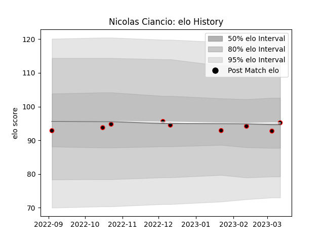

---  
layout: page  
title: Nicolas Ciancio  
date: 2023-03-17 17:15:49.217986  
categories: player  
---
# Nicolas Ciancio

## Positions: P

## Current elo: 96.0

## Current Percentile: None

# Elo History

# Match History

| Team   |   Appearances |   Win Rate |
|:-------|--------------:|-----------:|
| Nice   |             9 |        0.5 |

| Opponent                   |   Matches |   Win Rate |
|:---------------------------|----------:|-----------:|
| Tarbes                     |         2 |        0.5 |
| Albi                       |         1 |        0.5 |
| Bourgoin-Jallieu           |         1 |        0   |
| Carqueiranne-Hyères        |         1 |        1   |
| Narbonne                   |         1 |        0   |
| Rennes                     |         1 |        1   |
| US Bressane                |         1 |        1   |
| Valence Romans Drome Rugby |         1 |        0   |