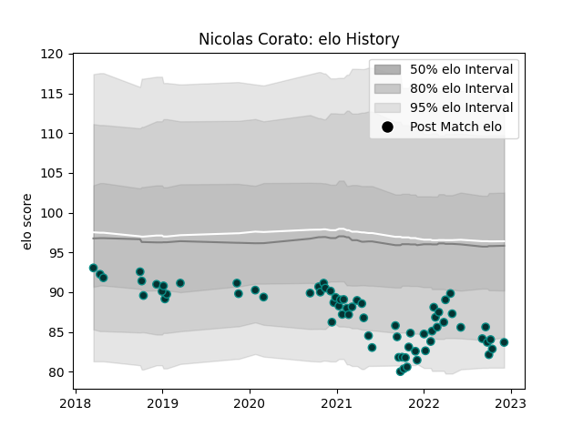

---  
layout: page  
title: Nicolas Corato  
date: 2023-01-17 11:33:09.453921  
categories: player  
---
# Nicolas Corato

## Positions: P

## Current elo: 63.0

## Current Percentile: 2.0

# Elo History

# Match History

| Team   |   Appearances |   Win Rate |
|:-------|--------------:|-----------:|
| Pau    |            79 |   0.405063 |

| Opponent             |   Matches |   Win Rate |
|:---------------------|----------:|-----------:|
| Clermont Auvergne    |         7 |   0.285714 |
| Montpellier Herault  |         7 |   0.428571 |
| Bordeaux Begles      |         6 |   0.5      |
| Castres Olympique    |         6 |   0.166667 |
| Stade Francais Paris |         6 |   0.333333 |
| Stade Toulousain     |         5 |   0.4      |
| Racing 92            |         5 |   0        |
| Brive                |         4 |   0.25     |
| Bayonne              |         4 |   0.875    |
| Perpignan            |         4 |   1        |
| Lyon                 |         4 |   0.5      |
| Agen                 |         3 |   0.666667 |
| Toulon               |         3 |   0.166667 |
| La Rochelle          |         3 |   0        |
| Ospreys              |         2 |   0.5      |
| Worcester Warriors   |         2 |   1        |
| Dragons              |         2 |   0.5      |
| Biarritz Olympique   |         2 |   1        |
| London Irish         |         1 |   0        |
| Edinburgh            |         1 |   0        |
| Cheetahs             |         1 |   0        |
| Leicester Tigers     |         1 |   0        |