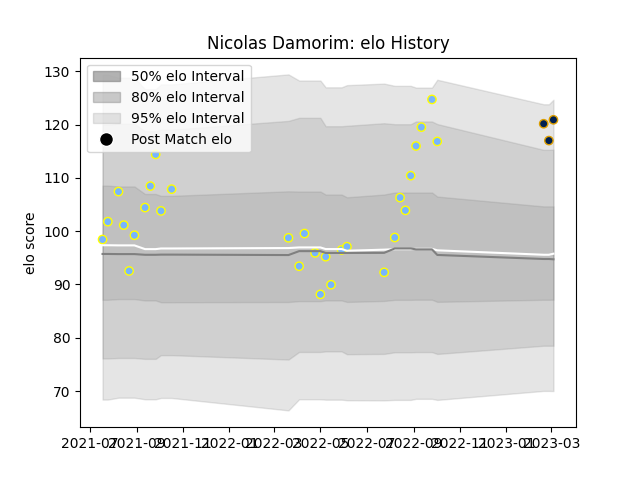

---  
layout: page  
title: Nicolas Damorim  
date: 2023-03-04 11:37:43.990303  
categories: player  
---
# Nicolas Damorim

## Positions: FL

## Current elo: 121.0

## Current Percentile: 91.0

# Elo History

# Match History

| Team      |   Appearances |   Win Rate |
|:----------|--------------:|-----------:|
| Hindu     |            29 |   0.896552 |
| Pampas XV |             3 |   0.666667 |

| Opponent             |   Matches |   Win Rate |
|:---------------------|----------:|-----------:|
| Alumni               |         3 |   1        |
| Buenos Aires         |         3 |   1        |
| CASI                 |         3 |   1        |
| Pucara               |         3 |   1        |
| Regatas Bella Vista  |         3 |   1        |
| SIC                  |         3 |   0.333333 |
| San Luis             |         3 |   1        |
| Atlético del Rosario |         2 |   1        |
| Los Tilos            |         2 |   1        |
| Newman               |         2 |   0.5      |
| American Raptors     |         1 |   1        |
| Belgrano             |         1 |   1        |
| CUBA                 |         1 |   1        |
| Cobras               |         1 |   1        |
| Selknam              |         1 |   0        |