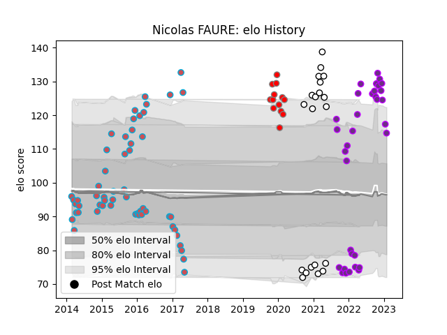

---  
layout: page  
title: Nicolas FAURE  
date: 2023-03-29 11:30:15.617419  
categories: player  
---
# Nicolas FAURE

Last updated: 2023-03-29
## Positions: SH

## Current elo: 118.0

## Current Percentile: 93.0

# Elo History

# Match History

| Team                       |   Appearances |   Win Rate |
|:---------------------------|--------------:|-----------:|
| Bourgoin-Jallieu           |            56 |   0.401786 |
| US Bressane                |            37 |   0.432432 |
| Valence Romans Drome Rugby |            20 |   0.325    |
| Roval Drome XV             |            13 |   0.230769 |

| Opponent                   |   Matches |   Win Rate |
|:---------------------------|----------:|-----------:|
| Mont-de-Marsan             |        10 |   0.45     |
| Narbonne                   |         9 |   0.5      |
| Colomiers                  |         9 |   0.444444 |
| Montauban                  |         8 |   0.3125   |
| Perpignan                  |         7 |   0.142857 |
| Beziers                    |         6 |   0.666667 |
| Carcassonne                |         6 |   0.5      |
| Aurillac                   |         6 |   0.666667 |
| Biarritz Olympique         |         5 |   0.2      |
| Nevers                     |         5 |   0.2      |
| Dax                        |         5 |   0.4      |
| Albi                       |         5 |   0.2      |
| Vannes                     |         5 |   0.2      |
| Bayonne                    |         4 |   0        |
| Soyaux-Angouleme           |         4 |   0.25     |
| Rouen                      |         3 |   0.666667 |
| Provence Rugby             |         3 |   0.333333 |
| Oyonnax                    |         3 |   0        |
| Grenoble                   |         3 |   0.333333 |
| Nice                       |         2 |   0.5      |
| Agen                       |         2 |   0.5      |
| Carqueiranne-Hyères        |         2 |   0.5      |
| Bourgoin-Jallieu           |         2 |   0.75     |
| Blagnac                    |         2 |   0.5      |
| Lyon                       |         2 |   0        |
| La Rochelle                |         1 |   0        |
| Chambery                   |         1 |   0        |
| Pau                        |         1 |   0        |
| Rennes                     |         1 |   1        |
| Auch                       |         1 |   0        |
| Suresnes                   |         1 |   1        |
| Tarbes                     |         1 |   1        |
| Valence Romans Drome Rugby |         1 |   1        |