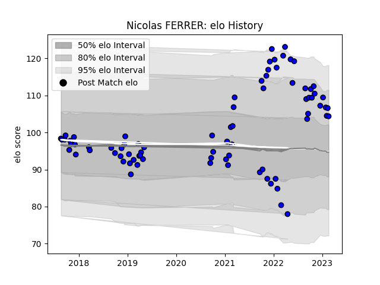

---  
layout: page  
title: Nicolas FERRER  
date: 2023-01-15 11:54:12.088830  
categories: player  
---
# Nicolas FERRER

## Positions: P

## Current elo: 108.0

## Current Percentile: 80.0

# Elo History

# Match History

| Team   |   Appearances |   Win Rate |
|:-------|--------------:|-----------:|
| Massy  |            73 |        0.5 |

| Opponent                   |   Matches |   Win Rate |
|:---------------------------|----------:|-----------:|
| Chambery                   |         4 |   0.625    |
| Montauban                  |         4 |   0        |
| Nice                       |         4 |   0.25     |
| Beziers                    |         3 |   0        |
| US Bressane                |         3 |   0.333333 |
| Tarbes                     |         3 |   0.666667 |
| Bourgoin-Jallieu           |         3 |   1        |
| Carcassonne                |         3 |   1        |
| Soyaux-Angouleme           |         3 |   0.333333 |
| Colomiers                  |         3 |   0.666667 |
| Dax                        |         3 |   1        |
| Provence Rugby             |         3 |   0.666667 |
| Oyonnax                    |         3 |   0        |
| Aurillac                   |         3 |   0.333333 |
| Vannes                     |         3 |   0.666667 |
| Valence Romans Drome Rugby |         2 |   1        |
| Nevers                     |         2 |   0        |
| Perpignan                  |         2 |   0.5      |
| Mont-de-Marsan             |         2 |   0.5      |
| Aubenas                    |         2 |   1        |
| Grenoble                   |         2 |   0        |
| Dijon                      |         2 |   1        |
| Cognac Saint Jean d'Angély |         2 |   1        |
| Blagnac                    |         2 |   0.5      |
| Bayonne                    |         2 |   0        |
| Narbonne                   |         1 |   0        |
| Rouen                      |         1 |   0        |
| Suresnes                   |         1 |   1        |
| Biarritz Olympique         |         1 |   0        |
| Albi                       |         1 |   1        |