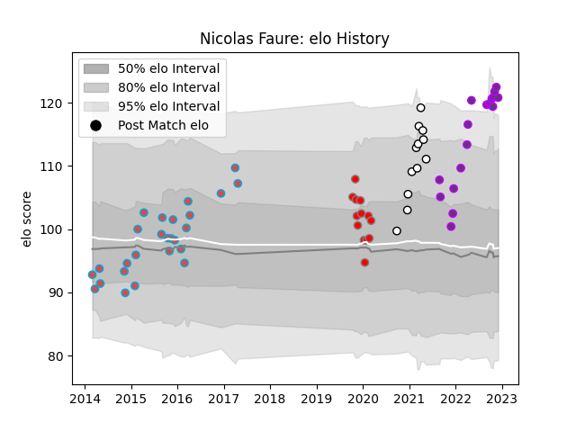

---  
layout: page  
title: Nicolas Faure  
date: 2022-12-18 16:12:28.631981  
categories: player  
---
# Nicolas Faure

## Positions: SH

## Current elo: 120.0

## Current Percentile: 96.0

# Elo History

# Match History

| Team                       |   Appearances |   Win Rate |
|:---------------------------|--------------:|-----------:|
| Bourgoin-Jallieu           |            26 |   0.461538 |
| US Bressane                |            20 |   0.5      |
| Roval Drome XV             |            13 |   0.230769 |
| Valence Romans Drome Rugby |            12 |   0.208333 |

| Opponent                   |   Matches |   Win Rate |
|:---------------------------|----------:|-----------:|
| Colomiers                  |         7 |   0.428571 |
| Montauban                  |         6 |   0.333333 |
| Perpignan                  |         6 |   0.166667 |
| Mont-de-Marsan             |         5 |   0.5      |
| Albi                       |         4 |   0.25     |
| Provence Rugby             |         3 |   0.333333 |
| Oyonnax                    |         3 |   0        |
| Dax                        |         3 |   0.333333 |
| Vannes                     |         3 |   0.333333 |
| Beziers                    |         3 |   0.333333 |
| Aurillac                   |         3 |   0.666667 |
| Grenoble                   |         2 |   0.5      |
| Biarritz Olympique         |         2 |   0        |
| Narbonne                   |         2 |   0        |
| Nevers                     |         2 |   0        |
| Soyaux-Angouleme           |         2 |   0.5      |
| Carcassonne                |         2 |   0.5      |
| Valence Romans Drome Rugby |         1 |   1        |
| Tarbes                     |         1 |   1        |
| Suresnes                   |         1 |   1        |
| Rouen                      |         1 |   0        |
| Rennes                     |         1 |   1        |
| Carqueiranne-Hyères        |         1 |   1        |
| Bayonne                    |         1 |   0        |
| Pau                        |         1 |   0        |
| Nice                       |         1 |   1        |
| Blagnac                    |         1 |   1        |
| La Rochelle                |         1 |   0        |
| Bourgoin-Jallieu           |         1 |   1        |
| Agen                       |         1 |   1        |