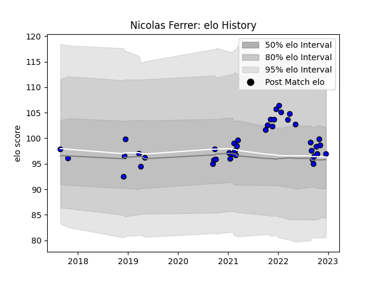

---  
layout: page  
title: Nicolas Ferrer  
date: 2022-12-18 16:38:29.219779  
categories: player  
---
# Nicolas Ferrer

## Positions: P

## Current elo: 97.0

## Current Percentile: 67.0

# Elo History

# Match History

| Team   |   Appearances |   Win Rate |
|:-------|--------------:|-----------:|
| Massy  |            41 |   0.487805 |

| Opponent                   |   Matches |   Win Rate |
|:---------------------------|----------:|-----------:|
| Nice                       |         4 |       0.25 |
| Aubenas                    |         2 |       1    |
| Dax                        |         2 |       1    |
| US Bressane                |         2 |       0.5  |
| Tarbes                     |         2 |       0.5  |
| Soyaux-Angouleme           |         2 |       0    |
| Oyonnax                    |         2 |       0    |
| Montauban                  |         2 |       0    |
| Aurillac                   |         2 |       0    |
| Grenoble                   |         2 |       0    |
| Colomiers                  |         2 |       0.5  |
| Chambery                   |         2 |       0.5  |
| Carcassonne                |         2 |       1    |
| Bourgoin-Jallieu           |         2 |       1    |
| Blagnac                    |         2 |       0.5  |
| Valence Romans Drome Rugby |         2 |       1    |
| Dijon                      |         1 |       1    |
| Mont-de-Marsan             |         1 |       1    |
| Cognac Saint Jean d'Angély |         1 |       1    |
| Nevers                     |         1 |       0    |
| Provence Rugby             |         1 |       1    |
| Rouen                      |         1 |       0    |
| Beziers                    |         1 |       0    |