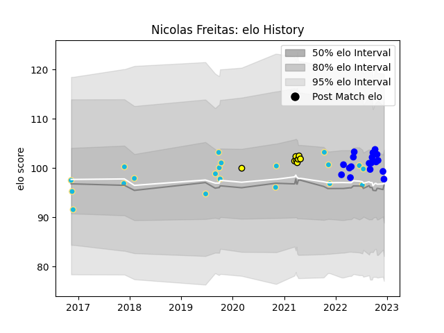

---  
layout: page  
title: Nicolas Freitas  
date: 2022-12-14 11:35:50.690212  
categories: player  
---
# Nicolas Freitas

## Positions: C, W

## Country: Uruguay

## Current elo: 98.0

## Current Percentile: 65.0

# Elo History

# Match History

| Team          |   Appearances |   Win Rate |
|:--------------|--------------:|-----------:|
| Uruguay       |            20 |   0.4      |
| Vannes        |            18 |   0.444444 |
| Penarol Rugby |             8 |   0.625    |

| Opponent                 |   Matches |   Win Rate |
|:-------------------------|----------:|-----------:|
| Romania                  |         4 |   0.25     |
| Spain                    |         4 |   0.25     |
| Selknam                  |         3 |   0.333333 |
| Colomiers                |         2 |   0.5      |
| Namibia                  |         2 |   1        |
| Olimpia Lions            |         2 |   1        |
| Oyonnax                  |         2 |   0        |
| Aurillac                 |         2 |   0.5      |
| Massy                    |         1 |   1        |
| Provence Rugby           |         1 |   0        |
| Rouen                    |         1 |   0        |
| Soyaux-Angouleme         |         1 |   0        |
| US Bressane              |         1 |   1        |
| Narbonne                 |         1 |   1        |
| United States of America |         1 |   1        |
| Mont-de-Marsan           |         1 |   0        |
| Agen                     |         1 |   0        |
| Jaguares XV              |         1 |   0        |
| Japan                    |         1 |   0        |
| Italy                    |         1 |   0        |
| Grenoble                 |         1 |   1        |
| Germany                  |         1 |   0        |
| Georgia                  |         1 |   0        |
| Fiji                     |         1 |   1        |
| Cobras                   |         1 |   1        |
| Carcassonne              |         1 |   1        |
| Canada                   |         1 |   1        |
| Cafeteros Pro            |         1 |   1        |
| Brazil                   |         1 |   1        |
| Biarritz Olympique       |         1 |   1        |
| Bayonne                  |         1 |   0        |
| Australia                |         1 |   0        |
| Wales                    |         1 |   0        |