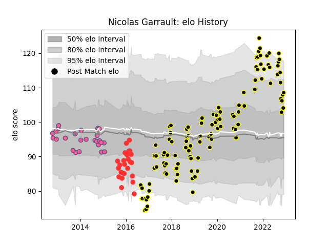

---  
layout: page  
title: Nicolas Garrault  
date: 2022-11-22 11:32:32.175533  
categories: player  
---
# Nicolas Garrault

## Positions: FL, L

## Current elo: 110.0

## Current Percentile: 84.0

# Elo History

# Match History

| Team                 |   Appearances |   Win Rate |
|:---------------------|--------------:|-----------:|
| Mont-de-Marsan       |           109 |   0.587156 |
| Stade Francais Paris |            27 |   0.62963  |
| Tarbes               |            25 |   0.48     |

| Opponent            |   Matches |   Win Rate |
|:--------------------|----------:|-----------:|
| Beziers             |        10 |   0.6      |
| Vannes              |         9 |   0.444444 |
| Biarritz Olympique  |         9 |   0.388889 |
| Montauban           |         9 |   0.555556 |
| Colomiers           |         8 |   0.625    |
| Grenoble            |         8 |   0.375    |
| Aurillac            |         7 |   0.428571 |
| Bayonne             |         7 |   0.642857 |
| Provence Rugby      |         7 |   0.571429 |
| Narbonne            |         7 |   0.714286 |
| Soyaux-Angouleme    |         6 |   0.666667 |
| Carcassonne         |         6 |   0.666667 |
| Perpignan           |         6 |   0.833333 |
| Oyonnax             |         5 |   0.6      |
| Rouen               |         4 |   0.75     |
| US Bressane         |         4 |   0.75     |
| Massy               |         4 |   0.5      |
| Agen                |         4 |   0.25     |
| Dax                 |         4 |   0.75     |
| Cavalieri Prato     |         4 |   1        |
| Nevers              |         3 |   0.666667 |
| Bourgoin-Jallieu    |         3 |   0.666667 |
| Brive               |         3 |   0.666667 |
| Bucuresti           |         2 |   1        |
| Albi                |         2 |   0        |
| London Welsh        |         2 |   1        |
| Lusitanos XV        |         2 |   1        |
| Dragons             |         2 |   0        |
| Mont-de-Marsan      |         2 |   0.5      |
| Bordeaux Begles     |         1 |   1        |
| Stade Toulousain    |         1 |   0        |
| Roval Drome XV      |         1 |   0        |
| Racing 92           |         1 |   1        |
| Harlequins          |         1 |   0        |
| Castres Olympique   |         1 |   0        |
| Newcastle Falcons   |         1 |   0        |
| La Rochelle         |         1 |   1        |
| Clermont Auvergne   |         1 |   0        |
| Montpellier Herault |         1 |   0        |
| Lyon                |         1 |   1        |
| London Irish        |         1 |   1        |