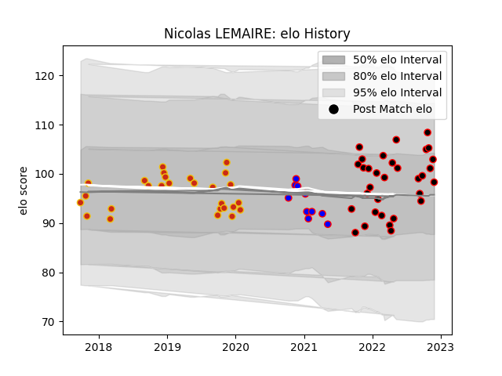

---  
layout: page  
title: Nicolas LEMAIRE  
date: 2023-03-11 00:13:25.115957  
categories: player  
---
# Nicolas LEMAIRE

## Positions: P

## Current elo: 97.0

## Current Percentile: 58.0

# Elo History

# Match History

| Team      |   Appearances |   Win Rate |
|:----------|--------------:|-----------:|
| Nice      |            33 |   0.484848 |
| Perpignan |            27 |   0.351852 |
| Beziers   |            10 |   0.3      |

| Opponent                   |   Matches |   Win Rate |
|:---------------------------|----------:|-----------:|
| Valence Romans Drome Rugby |         4 |   0.25     |
| Mont-de-Marsan             |         4 |   0.25     |
| Vannes                     |         3 |   0.333333 |
| Tarbes                     |         3 |   1        |
| Nevers                     |         3 |   0        |
| Soyaux-Angouleme           |         3 |   0.5      |
| Dax                        |         3 |   0.333333 |
| Suresnes                   |         3 |   0.666667 |
| Chambery                   |         3 |   0.333333 |
| Cognac Saint Jean d'Angély |         3 |   0.666667 |
| Blagnac                    |         3 |   0.666667 |
| Aurillac                   |         3 |   0.666667 |
| Bourgoin-Jallieu           |         2 |   0        |
| Bordeaux Begles            |         2 |   0        |
| Connacht                   |         2 |   0        |
| Dijon                      |         2 |   0.5      |
| Biarritz Olympique         |         2 |   1        |
| Montauban                  |         2 |   1        |
| Narbonne                   |         2 |   0.5      |
| Oyonnax                    |         2 |   0        |
| Rouen                      |         2 |   0        |
| Racing 92                  |         1 |   0        |
| Stade Toulousain           |         1 |   0        |
| US Bressane                |         1 |   0        |
| Roval Drome XV             |         1 |   1        |
| Agen                       |         1 |   0        |
| Provence Rugby             |         1 |   0        |
| Perpignan                  |         1 |   1        |
| Albi                       |         1 |   1        |
| Grenoble                   |         1 |   0        |
| Clermont Auvergne          |         1 |   0        |
| Carqueiranne-Hyères        |         1 |   1        |
| Beziers                    |         1 |   0        |
| Aubenas                    |         1 |   1        |
| Massy                      |         1 |   0        |