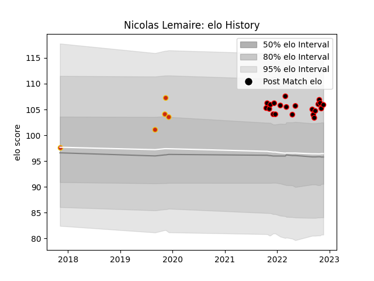

---  
layout: page  
title: Nicolas Lemaire  
date: 2022-12-14 11:13:26.186692  
categories: player  
---
# Nicolas Lemaire

## Positions: P

## Current elo: 104.0

## Current Percentile: 81.0

# Elo History

# Match History

| Team      |   Appearances |   Win Rate |
|:----------|--------------:|-----------:|
| Nice      |            23 |   0.565217 |
| Perpignan |             5 |   0.5      |

| Opponent                   |   Matches |   Win Rate |
|:---------------------------|----------:|-----------:|
| Tarbes                     |         3 |   1        |
| Suresnes                   |         3 |   0.666667 |
| Dax                        |         3 |   0.333333 |
| Chambery                   |         2 |   0.5      |
| Dijon                      |         2 |   0.5      |
| Albi                       |         1 |   1        |
| Oyonnax                    |         1 |   0        |
| Valence Romans Drome Rugby |         1 |   0        |
| US Bressane                |         1 |   0        |
| Soyaux-Angouleme           |         1 |   0.5      |
| Provence Rugby             |         1 |   0        |
| Massy                      |         1 |   0        |
| Narbonne                   |         1 |   0        |
| Aubenas                    |         1 |   1        |
| Cognac Saint Jean d'Angély |         1 |   1        |
| Carqueiranne-Hyères        |         1 |   1        |
| Bourgoin-Jallieu           |         1 |   0        |
| Blagnac                    |         1 |   1        |
| Biarritz Olympique         |         1 |   1        |
| Vannes                     |         1 |   1        |