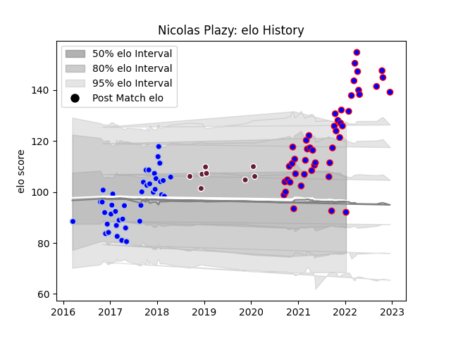

---  
layout: page  
title: Nicolas Plazy  
date: 2023-01-13 11:23:07.574121  
categories: player  
---
# Nicolas Plazy

## Positions: W

## Current elo: 93.0

## Current Percentile: 94.0

# Elo History

# Match History

| Team            |   Appearances |   Win Rate |
|:----------------|--------------:|-----------:|
| Beziers         |            48 |   0.479167 |
| Colomiers       |            40 |   0.5625   |
| Bordeaux Begles |             8 |   0.5625   |

| Opponent                   |   Matches |   Win Rate |
|:---------------------------|----------:|-----------:|
| Montauban                  |         7 |   0.571429 |
| Perpignan                  |         7 |   0.714286 |
| Mont-de-Marsan             |         6 |   0.166667 |
| Aurillac                   |         5 |   0.8      |
| Vannes                     |         5 |   0.4      |
| Soyaux-Angouleme           |         5 |   0.4      |
| Biarritz Olympique         |         5 |   0.6      |
| Oyonnax                    |         5 |   0.3      |
| Dax                        |         4 |   0.5      |
| Agen                       |         4 |   0.875    |
| Carcassonne                |         4 |   0.25     |
| Beziers                    |         4 |   0.25     |
| Colomiers                  |         3 |   0.666667 |
| Bayonne                    |         3 |   0.666667 |
| Narbonne                   |         3 |   1        |
| Nevers                     |         3 |   0.333333 |
| Provence Rugby             |         3 |   0.333333 |
| Rouen                      |         3 |   0.333333 |
| Wasps                      |         2 |   1        |
| US Bressane                |         2 |   0        |
| Massy                      |         2 |   1        |
| Albi                       |         2 |   0.5      |
| Grenoble                   |         2 |   1        |
| Sale Sharks                |         2 |   0.5      |
| Valence Romans Drome Rugby |         1 |   0.5      |
| Connacht                   |         1 |   0        |
| Stade Toulousain           |         1 |   0        |
| Montpellier Herault        |         1 |   0.5      |
| Bourgoin-Jallieu           |         1 |   1        |