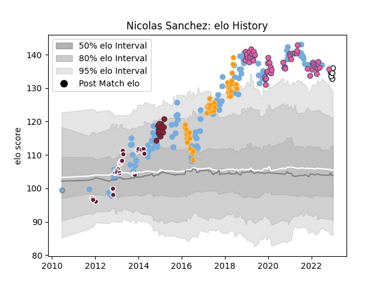

---  
layout: page  
title: Nicolas Sanchez  
date: 2022-11-22 11:45:01.398189  
categories: player  
---
# Nicolas Sanchez

## Positions: FH

## Country: Argentina

## Current elo: 127.0

## Current Percentile: 96.0

# Elo History

# Match History

| Team                 |   Appearances |   Win Rate |
|:---------------------|--------------:|-----------:|
| Argentina            |            91 |  0.28022   |
| Stade Francais Paris |            52 |  0.432692  |
| Jaguares             |            41 |  0.414634  |
| Bordeaux Begles      |            17 |  0.0882353 |
| Toulon               |            14 |  0.714286  |
| Argentina Jaguares   |             1 |  0         |

| Opponent                 |   Matches |   Win Rate |
|:-------------------------|----------:|-----------:|
| South Africa             |        16 |   0.15625  |
| Australia                |        16 |   0.21875  |
| New Zealand              |        16 |   0.0625   |
| Lions                    |         7 |   0.428571 |
| Montpellier Herault      |         7 |   0.214286 |
| France                   |         7 |   0.285714 |
| Scotland                 |         7 |   0.142857 |
| Wales                    |         7 |   0.357143 |
| Ireland                  |         6 |   0.166667 |
| Clermont Auvergne        |         6 |   0.166667 |
| Bayonne                  |         6 |   0.166667 |
| Sharks                   |         6 |   0.166667 |
| Brive                    |         5 |   0.6      |
| Racing 92                |         5 |   0.6      |
| Italy                    |         4 |   1        |
| Castres Olympique        |         4 |   0.625    |
| Pau                      |         4 |   0.75     |
| England                  |         4 |   0        |
| Stormers                 |         4 |   0.25     |
| Toulon                   |         4 |   0.25     |
| Bulls                    |         4 |   0.5      |
| Stade Toulousain         |         4 |   0.5      |
| La Rochelle              |         4 |   0.5      |
| Romania                  |         3 |   0.666667 |
| Lyon                     |         3 |   0.666667 |
| Southern Kings           |         3 |   0.333333 |
| Agen                     |         3 |   0.666667 |
| Grenoble                 |         3 |   0.666667 |
| Connacht                 |         2 |   0.5      |
| Bristol Rugby            |         2 |   0        |
| Stade Francais Paris     |         2 |   0        |
| Chiefs                   |         2 |   0.5      |
| Bordeaux Begles          |         2 |   0        |
| Hurricanes               |         2 |   0        |
| Blues                    |         2 |   0.5      |
| Queensland Reds          |         2 |   0.5      |
| Perpignan                |         2 |   0.5      |
| Tonga                    |         2 |   1        |
| Brumbies                 |         2 |   0.5      |
| Georgia                  |         2 |   1        |
| New South Wales Waratahs |         2 |   1        |
| Melbourne Rebels         |         2 |   1        |
| Leicester Tigers         |         2 |   0.5      |
| Biarritz Olympique       |         1 |   0        |
| United States of America |         1 |   1        |
| Bath Rugby               |         1 |   0        |
| Wasps                    |         1 |   0        |
| Worcester Warriors       |         1 |   0        |
| Ulster                   |         1 |   1        |
| Japan                    |         1 |   1        |
| Cheetahs                 |         1 |   1        |
| Scarlets                 |         1 |   1        |
| Crusaders                |         1 |   0        |
| Dragons                  |         1 |   1        |
| Oyonnax                  |         1 |   0        |
| Ospreys                  |         1 |   1        |
| Gloucester Rugby         |         1 |   0        |
| Mont-de-Marsan           |         1 |   0        |
| London Irish             |         1 |   0        |
| Highlanders              |         1 |   0        |
| Zebre                    |         1 |   1        |