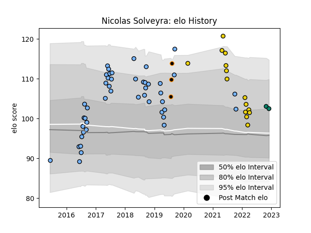

---  
layout: page  
title: Nicolas Solveyra  
date: 2022-12-12 15:34:43.400143  
categories: player  
---
# Nicolas Solveyra

## Positions: P

## Current elo: 103.0

## Current Percentile: 76.0

# Elo History

# Match History

| Team              |   Appearances |   Win Rate |
|:------------------|--------------:|-----------:|
| CUBA              |            46 |   0.586957 |
| Houston SaberCats |            14 |   0.285714 |
| Jaguares XV       |             3 |   1        |
| Montauban         |             2 |   0        |

| Opponent               |   Matches |   Win Rate |
|:-----------------------|----------:|-----------:|
| Alumni                 |         4 |   0.5      |
| CASI                   |         4 |   0.25     |
| Pucara                 |         4 |   0.75     |
| Hindu                  |         4 |   0.5      |
| SIC                    |         4 |   0.5      |
| Belgrano               |         4 |   0.5      |
| Utah Warriors          |         3 |   0.333333 |
| La Plata               |         3 |   1        |
| San Luis               |         3 |   0.166667 |
| Newman                 |         3 |   0.5      |
| Atlético del Rosario   |         3 |   1        |
| Regatas Bella Vista    |         3 |   0.333333 |
| L. A. Giltinis         |         2 |   0.5      |
| Los Tilos              |         2 |   1        |
| San Martin             |         2 |   0.5      |
| Austin Gilgronis       |         2 |   0        |
| Lomas                  |         2 |   1        |
| Seattle Seawolves      |         1 |   1        |
| Rugby ATL              |         1 |   0        |
| San Diego Legion       |         1 |   0        |
| SWD Eagles             |         1 |   1        |
| Old Glory DC           |         1 |   0        |
| Rouen                  |         1 |   0        |
| R.U. New York          |         1 |   0        |
| Provence Rugby         |         1 |   0        |
| NOLA Gold              |         1 |   0        |
| Mariano Moreno         |         1 |   1        |
| Eastern Province Kings |         1 |   1        |
| Dallas Jackals         |         1 |   1        |
| Valke                  |         1 |   1        |