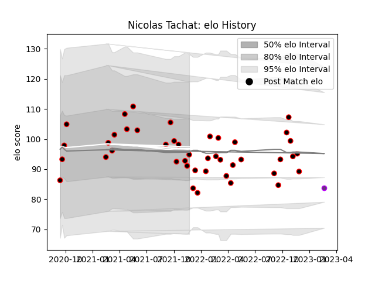

---  
layout: page  
title: Nicolas Tachat  
date: 2023-02-24 02:24:48.093240  
categories: player  
---
# Nicolas Tachat

## Positions: FL

## Current elo: 95.0

## Current Percentile: 37.0

# Elo History

# Match History

| Team        |   Appearances |   Win Rate |
|:------------|--------------:|-----------:|
| Nice        |            43 |   0.581395 |
| US Bressane |             1 |   0        |

| Opponent                   |   Matches |   Win Rate |
|:---------------------------|----------:|-----------:|
| Bourgoin-Jallieu           |         5 |   0.6      |
| Chambery                   |         4 |   0.5      |
| Tarbes                     |         4 |   0.875    |
| Valence Romans Drome Rugby |         4 |   0        |
| Albi                       |         3 |   0.833333 |
| Aubenas                    |         3 |   1        |
| Massy                      |         3 |   0.666667 |
| Narbonne                   |         3 |   0        |
| Suresnes                   |         3 |   0.666667 |
| Blagnac                    |         2 |   1        |
| Cognac Saint Jean d'Angély |         2 |   1        |
| Dax                        |         2 |   0.5      |
| Soyaux-Angouleme           |         2 |   0.5      |
| US Bressane                |         2 |   0.5      |
| Carqueiranne-Hyères        |         1 |   0        |
| Dijon                      |         1 |   0        |