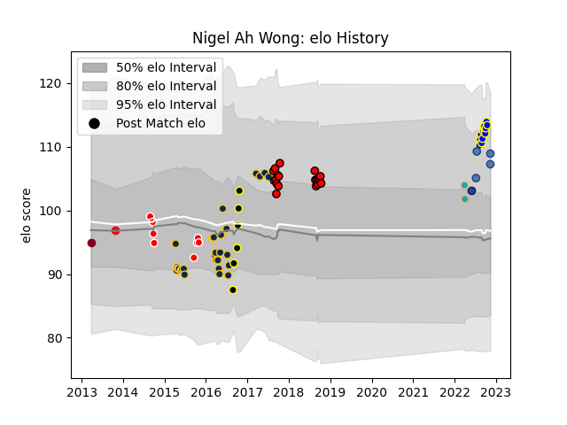

---  
layout: page  
title: Nigel Ah Wong  
date: 2022-11-15 23:45:31.616544  
categories: player  
---
# Nigel Ah Wong

## Positions: W, C

## Country: Samoa

## Current elo: 107.0

## Current Percentile: 86.0

# Elo History

# Match History

| Team                 |   Appearances |   Win Rate |
|:---------------------|--------------:|-----------:|
| Brumbies             |            30 |   0.566667 |
| Counties Manukau     |            19 |   0.342105 |
| Bay of Plenty        |            12 |   0.583333 |
| Canberra Vikings     |             8 |   0.625    |
| Tokyo Sungoliath     |             6 |   1        |
| Samoa                |             4 |   0.75     |
| Moana Pasifika       |             2 |   0        |
| Blues                |             1 |   1        |
| Coca-Cola Red Sparks |             1 |   0        |
| Queensland Reds      |             1 |   1        |

| Opponent                          |   Matches |   Win Rate |
|:----------------------------------|----------:|-----------:|
| New South Wales Waratahs          |         5 |   0.8      |
| Blues                             |         4 |   0        |
| Auckland                          |         3 |   0.666667 |
| Northland                         |         3 |   0.333333 |
| Western Force                     |         3 |   1        |
| Bulls                             |         3 |   1        |
| Canterbury                        |         3 |   0        |
| Waikato                           |         3 |   0.333333 |
| Hurricanes                        |         3 |   0.333333 |
| Taranaki                          |         3 |   0.333333 |
| Melbourne Rebels                  |         3 |   0.666667 |
| Stormers                          |         3 |   0.333333 |
| Highlanders                       |         3 |   0.333333 |
| North Harbour                     |         3 |   0.333333 |
| Sydney Stars                      |         2 |   0.75     |
| Queensland Reds                   |         2 |   0.5      |
| Southland                         |         2 |   1        |
| Tasman                            |         2 |   0.5      |
| Wellington                        |         2 |   0        |
| Bay of Plenty                     |         2 |   0.25     |
| Melbourne Rising                  |         2 |   0.5      |
| Cheetahs                          |         2 |   1        |
| Hawke's Bay                       |         2 |   1        |
| Manawatu                          |         1 |   1        |
| Georgia                           |         1 |   1        |
| Brisbane City                     |         1 |   0        |
| Chiefs                            |         1 |   0        |
| Toyota Industries Shuttles Aichi  |         1 |   1        |
| Tonga                             |         1 |   1        |
| Counties Manukau                  |         1 |   0        |
| Crusaders                         |         1 |   0        |
| Fiji                              |         1 |   1        |
| Sunwolves                         |         1 |   1        |
| Greater Sydney Rams               |         1 |   1        |
| Kubota Spears Funabashi Tokyo-Bay |         1 |   0        |
| Green Rockets Tokatsu             |         1 |   1        |
| Queensland Country                |         1 |   1        |
| Otago                             |         1 |   1        |
| Hanazono Kintetsu Liners          |         1 |   1        |
| North Harbour Rays                |         1 |   0.5      |
| Italy                             |         1 |   0        |
| Munakata Sanix Blues              |         1 |   1        |
| Mie Honda Heat                    |         1 |   1        |
| Yokohama Canon Eagles             |         1 |   1        |