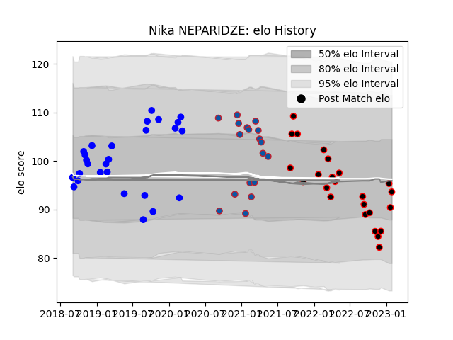

---  
layout: page  
title: Nika NEPARIDZE  
date: 2023-01-30 18:30:58.914603  
categories: player  
---
# Nika NEPARIDZE

## Positions: P

## Current elo: 87.0

## Current Percentile: 16.0

# Elo History

# Match History

| Team     |   Appearances |   Win Rate |
|:---------|--------------:|-----------:|
| Vannes   |            26 |   0.538462 |
| Nice     |            24 |   0.479167 |
| Grenoble |            18 |   0.5      |

| Opponent                   |   Matches |   Win Rate |
|:---------------------------|----------:|-----------:|
| Aurillac                   |         5 |   0.6      |
| Massy                      |         4 |   0.75     |
| Provence Rugby             |         4 |   0.5      |
| Biarritz Olympique         |         4 |   0.25     |
| Bourgoin-Jallieu           |         4 |   0.25     |
| Nevers                     |         4 |   0.75     |
| Carcassonne                |         4 |   0.25     |
| Colomiers                  |         3 |   0.666667 |
| Oyonnax                    |         3 |   1        |
| Mont-de-Marsan             |         3 |   0.666667 |
| Dax                        |         3 |   0.333333 |
| Albi                       |         3 |   0.833333 |
| Cognac Saint Jean d'Angély |         2 |   0.5      |
| Montauban                  |         2 |   0        |
| Blagnac                    |         2 |   0.5      |
| Perpignan                  |         2 |   0        |
| Beziers                    |         2 |   1        |
| Soyaux-Angouleme           |         2 |   0        |
| Suresnes                   |         2 |   1        |
| Valence Romans Drome Rugby |         2 |   0.5      |
| Dijon                      |         1 |   0        |
| Aubenas                    |         1 |   1        |
| Chambery                   |         1 |   0        |
| Narbonne                   |         1 |   0        |
| Brive                      |         1 |   0        |
| Rennes                     |         1 |   1        |
| Rouen                      |         1 |   0        |
| Roval Drome XV             |         1 |   1        |