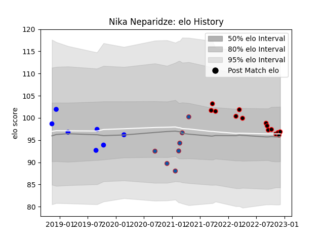

---  
layout: page  
title: Nika Neparidze  
date: 2022-12-09 13:20:52.480031  
categories: player  
---
# Nika Neparidze

## Positions: P

## Current elo: 97.0

## Current Percentile: 56.0

# Elo History

# Match History

| Team     |   Appearances |   Win Rate |
|:---------|--------------:|-----------:|
| Nice     |            14 |   0.464286 |
| Grenoble |             7 |   0.571429 |
| Vannes   |             7 |   0.142857 |

| Opponent                   |   Matches |   Win Rate |
|:---------------------------|----------:|-----------:|
| Aurillac                   |         4 |   0.5      |
| Bourgoin-Jallieu           |         3 |   0.333333 |
| Albi                       |         2 |   0.75     |
| Blagnac                    |         2 |   0.5      |
| Carcassonne                |         2 |   0        |
| Nevers                     |         2 |   0.5      |
| Cognac Saint Jean d'Angély |         2 |   0.5      |
| Mont-de-Marsan             |         1 |   0        |
| Rouen                      |         1 |   0        |
| Rennes                     |         1 |   1        |
| Narbonne                   |         1 |   0        |
| Colomiers                  |         1 |   1        |
| Massy                      |         1 |   1        |
| Dax                        |         1 |   0        |
| Chambery                   |         1 |   0        |
| Brive                      |         1 |   0        |
| Biarritz Olympique         |         1 |   0        |
| Valence Romans Drome Rugby |         1 |   1        |