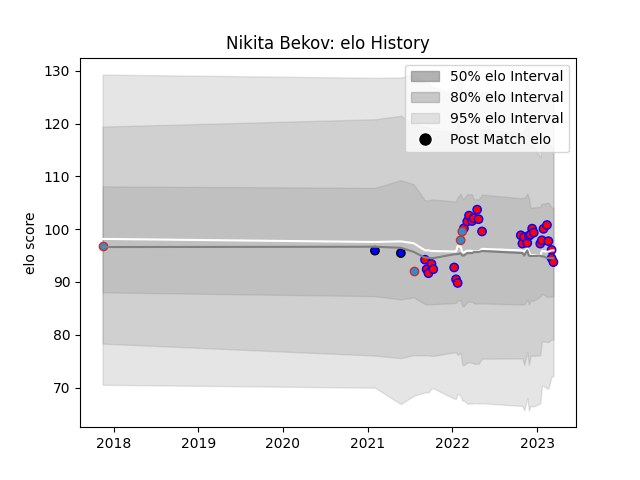

---  
layout: page  
title: Nikita Bekov  
date: 2023-01-17 11:45:18.640389  
categories: player  
---
# Nikita Bekov

## Positions: L, FL

## Country: Russia

## Current elo: 97.0

## Current Percentile: 61.0

# Elo History

# Match History

| Team    |   Appearances |   Win Rate |
|:--------|--------------:|-----------:|
| Blagnac |            25 |       0.5  |
| Russia  |             4 |       0.25 |
| Massy   |             2 |       1    |

| Opponent                   |   Matches |   Win Rate |
|:---------------------------|----------:|-----------:|
| Albi                       |         3 |   0.333333 |
| Nice                       |         3 |   0.333333 |
| Dax                        |         2 |   0.5      |
| Aubenas                    |         2 |   1        |
| Massy                      |         2 |   0.5      |
| Valence Romans Drome Rugby |         2 |   1        |
| Cognac Saint Jean d'Angély |         2 |   0        |
| Chambery                   |         2 |   0.5      |
| Bourgoin-Jallieu           |         2 |   0.5      |
| Dijon                      |         1 |   0        |
| Kenya                      |         1 |   1        |
| Carqueiranne-Hyères        |         1 |   1        |
| Portugal                   |         1 |   0        |
| Rennes                     |         1 |   1        |
| Romania                    |         1 |   0        |
| Soyaux-Angouleme           |         1 |   0        |
| Spain                      |         1 |   0        |
| Suresnes                   |         1 |   1        |
| Tarbes                     |         1 |   1        |
| Narbonne                   |         1 |   0.5      |