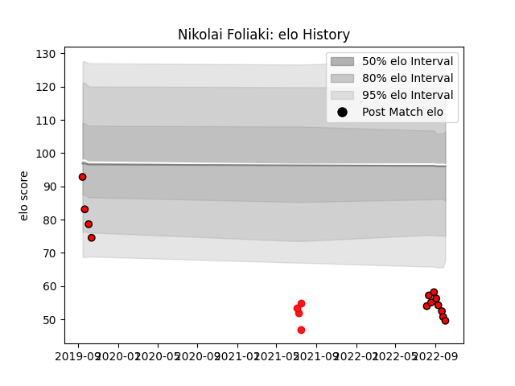

---  
layout: page  
title: Nikolai Foliaki  
date: 2023-03-12 11:30:18.434006  
categories: player  
---
# Nikolai Foliaki

## Positions: C

## Country: Tonga

## Current elo: 50.0

## Current Percentile: 1.0

# Elo History

# Match History

| Team             |   Appearances |   Win Rate |
|:-----------------|--------------:|-----------:|
| Counties Manukau |            13 |   0.230769 |
| Tonga            |             4 |   0        |

| Opponent      |   Matches |   Win Rate |
|:--------------|----------:|-----------:|
| Samoa         |         3 |        0   |
| Hawke's Bay   |         2 |        0   |
| Manawatu      |         2 |        0.5 |
| Southland     |         2 |        0   |
| Auckland      |         1 |        0   |
| Bay of Plenty |         1 |        1   |
| New Zealand   |         1 |        0   |
| North Harbour |         1 |        0   |
| Otago         |         1 |        1   |
| Taranaki      |         1 |        0   |
| Waikato       |         1 |        0   |
| Wellington    |         1 |        0   |