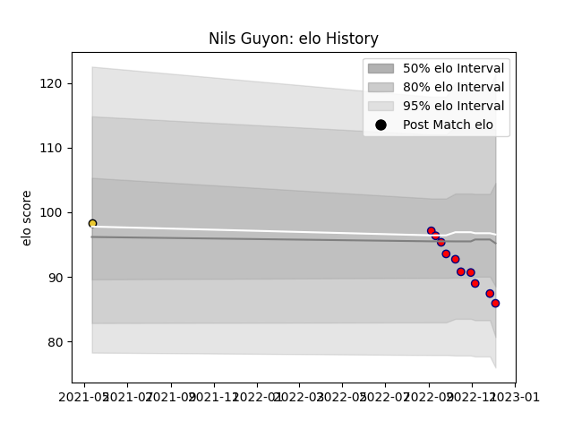

---  
layout: page  
title: Nils Guyon  
date: 2022-12-18 16:20:14.394006  
categories: player  
---
# Nils Guyon

## Positions: W, FB

## Current elo: 84.0

## Current Percentile: 18.0

# Elo History

# Match History

| Team                       |   Appearances |   Win Rate |
|:---------------------------|--------------:|-----------:|
| Cognac Saint Jean d'Angély |            11 |          0 |
| La Rochelle                |             1 |          0 |

| Opponent                   |   Matches |   Win Rate |
|:---------------------------|----------:|-----------:|
| Albi                       |         1 |          0 |
| Blagnac                    |         1 |          0 |
| Bourgoin-Jallieu           |         1 |          0 |
| Brive                      |         1 |          0 |
| Carqueiranne-Hyères        |         1 |          0 |
| Chambery                   |         1 |          0 |
| Dax                        |         1 |          0 |
| Narbonne                   |         1 |          0 |
| Suresnes                   |         1 |          0 |
| Tarbes                     |         1 |          0 |
| US Bressane                |         1 |          0 |
| Valence Romans Drome Rugby |         1 |          0 |