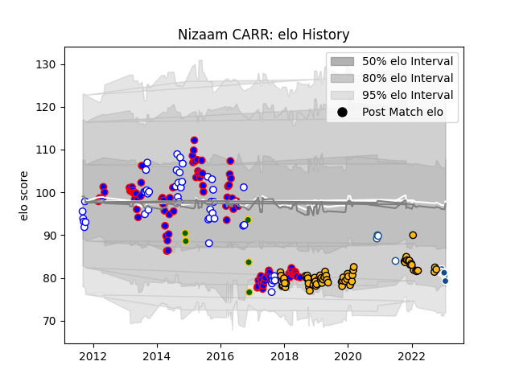

---  
layout: page  
title: Nizaam CARR  
date: 2023-02-28 11:08:52.495032  
categories: player  
---
# Nizaam CARR

## Positions: N8, FL

## Country: South Africa

## Current elo: 88.0

## Current Percentile: 31.0

# Elo History

# Match History

| Team             |   Appearances |   Win Rate |
|:-----------------|--------------:|-----------:|
| Stormers         |            99 |   0.555556 |
| Wasps            |            70 |   0.407143 |
| Western Province |            51 |   0.745098 |
| South Africa     |             5 |   0.2      |
| Blue Bulls       |             4 |   0.75     |
| Bulls            |             1 |   1        |

| Opponent                 |   Matches |   Win Rate |
|:-------------------------|----------:|-----------:|
| Bulls                    |        12 |   0.666667 |
| Cheetahs                 |        11 |   0.727273 |
| Golden Lions             |        11 |   0.590909 |
| Blue Bulls               |        11 |   0.681818 |
| Sharks                   |        10 |   0.4      |
| Lions                    |         9 |   0.388889 |
| Griquas                  |         8 |   0.875    |
| Free State Cheetahs      |         8 |   0.75     |
| Bath Rugby               |         8 |   0.5625   |
| Chiefs                   |         7 |   0.285714 |
| Pumas                    |         6 |   0.833333 |
| Gloucester Rugby         |         6 |   0.333333 |
| Harlequins               |         6 |   0.166667 |
| Crusaders                |         5 |   0        |
| Brumbies                 |         5 |   0.6      |
| Northampton Saints       |         5 |   0.4      |
| Saracens                 |         5 |   0.2      |
| Blues                    |         5 |   0.8      |
| New South Wales Waratahs |         5 |   0.2      |
| Natal Sharks             |         5 |   0.6      |
| Queensland Reds          |         5 |   0.8      |
| Sale Sharks              |         4 |   0.25     |
| Sunwolves                |         4 |   0.625    |
| Melbourne Rebels         |         4 |   0.75     |
| London Irish             |         4 |   0.75     |
| Leicester Tigers         |         4 |   0.5      |
| Worcester Warriors       |         4 |   0.75     |
| Jaguares                 |         4 |   0.75     |
| Highlanders              |         4 |   0.25     |
| Bristol Rugby            |         4 |   0.5      |
| Eastern Province Kings   |         3 |   1        |
| Western Force            |         3 |   1        |
| Stade Toulousain         |         3 |   0.333333 |
| Hurricanes               |         3 |   0.666667 |
| Newcastle Falcons        |         3 |   0.666667 |
| Exeter Chiefs            |         3 |   0.333333 |
| Southern Kings           |         3 |   1        |
| Wales                    |         2 |   0        |
| Leinster                 |         2 |   0        |
| Ospreys                  |         2 |   1        |
| Munster                  |         2 |   0        |
| Italy                    |         2 |   0.5      |
| La Rochelle              |         2 |   0.5      |
| Edinburgh                |         2 |   0        |
| Leopards                 |         1 |   1        |
| England                  |         1 |   0        |
| Bordeaux Begles          |         1 |   0        |
| Boland Cavaliers         |         1 |   1        |
| Ulster                   |         1 |   1        |
| Western Province         |         1 |   1        |