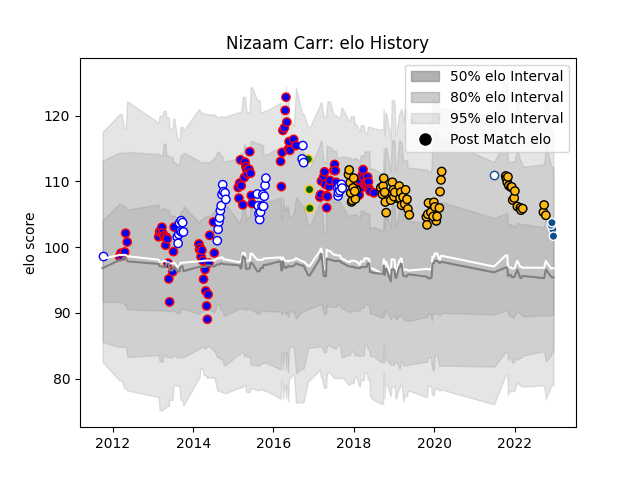

---  
layout: page  
title: Nizaam Carr  
date: 2022-12-09 13:15:36.839028  
categories: player  
---
# Nizaam Carr

## Positions: N8, FL

## Country: South Africa

## Current elo: 104.0

## Current Percentile: 75.0

# Elo History

# Match History

| Team             |   Appearances |   Win Rate |
|:-----------------|--------------:|-----------:|
| Stormers         |            98 |   0.55102  |
| Wasps            |            69 |   0.398551 |
| Western Province |            42 |   0.785714 |
| South Africa     |             3 |   0        |
| Bulls            |             2 |   1        |
| Blue Bulls       |             1 |   1        |

| Opponent                 |   Matches |   Win Rate |
|:-------------------------|----------:|-----------:|
| Bulls                    |        11 |   0.636364 |
| Cheetahs                 |        11 |   0.727273 |
| Sharks                   |        10 |   0.4      |
| Blue Bulls               |         9 |   0.833333 |
| Lions                    |         9 |   0.388889 |
| Golden Lions             |         8 |   0.5625   |
| Bath Rugby               |         8 |   0.5625   |
| Chiefs                   |         7 |   0.285714 |
| Griquas                  |         7 |   0.857143 |
| Free State Cheetahs      |         6 |   0.833333 |
| Harlequins               |         6 |   0.166667 |
| Pumas                    |         6 |   0.833333 |
| Gloucester Rugby         |         6 |   0.333333 |
| New South Wales Waratahs |         5 |   0.2      |
| Blues                    |         5 |   0.8      |
| Brumbies                 |         5 |   0.6      |
| Northampton Saints       |         5 |   0.4      |
| Crusaders                |         5 |   0        |
| Saracens                 |         5 |   0.2      |
| Queensland Reds          |         5 |   0.8      |
| Sale Sharks              |         4 |   0.25     |
| Sunwolves                |         4 |   0.625    |
| Leicester Tigers         |         4 |   0.5      |
| Melbourne Rebels         |         4 |   0.75     |
| London Irish             |         4 |   0.75     |
| Jaguares                 |         4 |   0.75     |
| Worcester Warriors       |         4 |   0.75     |
| Highlanders              |         4 |   0.25     |
| Bristol Rugby            |         4 |   0.5      |
| Eastern Province Kings   |         3 |   1        |
| Western Force            |         3 |   1        |
| Hurricanes               |         3 |   0.666667 |
| Natal Sharks             |         3 |   0.666667 |
| Exeter Chiefs            |         3 |   0.333333 |
| Newcastle Falcons        |         3 |   0.666667 |
| Southern Kings           |         3 |   1        |
| Stade Toulousain         |         2 |   0        |
| La Rochelle              |         2 |   0.5      |
| Leinster                 |         2 |   0        |
| Ospreys                  |         2 |   1        |
| Munster                  |         2 |   0        |
| Edinburgh                |         2 |   0        |
| Cardiff Blues            |         1 |   1        |
| Bordeaux Begles          |         1 |   0        |
| England                  |         1 |   0        |
| Boland Cavaliers         |         1 |   1        |
| Ulster                   |         1 |   1        |
| Wales                    |         1 |   0        |
| Italy                    |         1 |   0        |