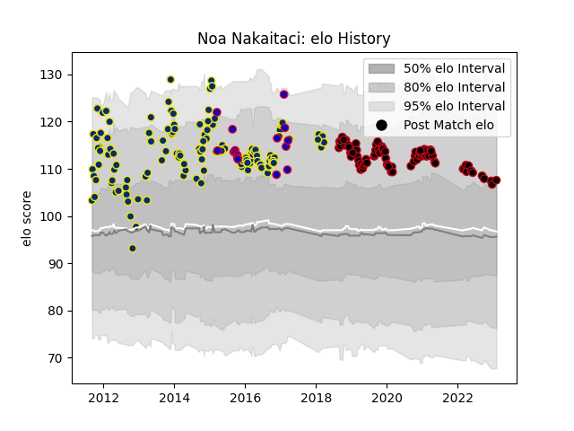

---  
layout: page  
title: Noa Nakaitaci  
date: 2022-12-14 11:27:01.886449  
categories: player  
---
# Noa Nakaitaci

## Positions: W

## Country: France

## Current elo: 94.0

## Current Percentile: 41.0

# Elo History

# Match History

| Team              |   Appearances |   Win Rate |
|:------------------|--------------:|-----------:|
| Clermont Auvergne |           127 |   0.700787 |
| Lyon              |            75 |   0.513333 |
| France            |            15 |   0.533333 |

| Opponent             |   Matches |   Win Rate |
|:---------------------|----------:|-----------:|
| Toulon               |        16 |   0.53125  |
| Bordeaux Begles      |        16 |   0.6875   |
| Stade Toulousain     |        15 |   0.633333 |
| Castres Olympique    |        15 |   0.5      |
| Racing 92            |        13 |   0.653846 |
| Brive                |        12 |   0.833333 |
| La Rochelle          |        11 |   0.590909 |
| Montpellier Herault  |        11 |   0.636364 |
| Stade Francais Paris |        11 |   0.681818 |
| Agen                 |         9 |   0.888889 |
| Bayonne              |         8 |   0.6875   |
| Clermont Auvergne    |         7 |   0.142857 |
| Oyonnax              |         6 |   0.5      |
| Biarritz Olympique   |         6 |   0.666667 |
| Saracens             |         5 |   0.4      |
| Perpignan            |         5 |   1        |
| Exeter Chiefs        |         4 |   0.75     |
| Grenoble             |         4 |   1        |
| Pau                  |         3 |   0.666667 |
| Italy                |         3 |   1        |
| England              |         3 |   0.333333 |
| Munster              |         3 |   1        |
| Northampton Saints   |         3 |   0.333333 |
| Ospreys              |         3 |   0.666667 |
| Scarlets             |         2 |   1        |
| Sale Sharks          |         2 |   1        |
| Ulster               |         2 |   0.5      |
| Scotland             |         2 |   1        |
| Leinster             |         2 |   0        |
| New Zealand          |         2 |   0        |
| Lyon                 |         2 |   0.5      |
| Ireland              |         2 |   0        |
| Romania              |         1 |   1        |
| Aironi               |         1 |   1        |
| Leicester Tigers     |         1 |   1        |
| Glasgow Warriors     |         1 |   0        |
| Cardiff Blues        |         1 |   0        |
| Bulls                |         1 |   0        |
| Benetton Treviso     |         1 |   0        |
| Australia            |         1 |   0        |
| Wales                |         1 |   1        |