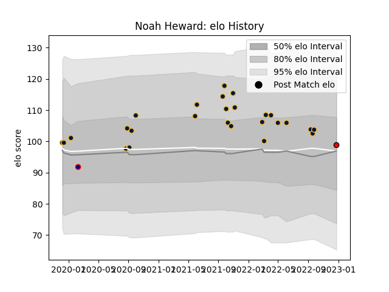

---  
layout: page  
title: Noah Heward  
date: 2023-03-21 18:37:40.358149  
categories: player  
---
# Noah Heward

Last updated: 2023-03-21
## Positions: W, FB

## Current elo: 94.0

## Current Percentile: 23.0

# Elo History

# Match History

| Team               |   Appearances |   Win Rate |
|:-------------------|--------------:|-----------:|
| Worcester Warriors |            26 |   0.384615 |
| Bristol Rugby      |             2 |   0.5      |
| Hartpury College   |             2 |   0.5      |
| London Scottish    |             1 |   0        |

| Opponent           |   Matches |   Win Rate |
|:-------------------|----------:|-----------:|
| London Irish       |         5 |   0.4      |
| Newcastle Falcons  |         4 |   0.5      |
| Exeter Chiefs      |         3 |   0.333333 |
| Harlequins         |         3 |   0.333333 |
| Saracens           |         2 |   0.5      |
| Dragons            |         2 |   0.5      |
| Bristol Rugby      |         2 |   0        |
| Bath Rugby         |         1 |   1        |
| Nottingham         |         1 |   0        |
| Sale Sharks        |         1 |   1        |
| RC Enisei          |         1 |   1        |
| Leicester Tigers   |         1 |   0        |
| Northampton Saints |         1 |   0        |
| Jersey             |         1 |   0        |
| Gloucester Rugby   |         1 |   0        |
| Cornish Pirates    |         1 |   1        |
| Wasps              |         1 |   0        |