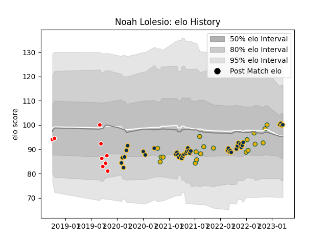

---  
layout: page  
title: Noah Lolesio  
date: 2023-02-24 09:49:09.576113  
categories: player  
---
# Noah Lolesio

## Positions: FH

## Country: Australia

## Current elo: 98.0

## Current Percentile: 39.0

# Elo History

# Match History

| Team             |   Appearances |   Win Rate |
|:-----------------|--------------:|-----------:|
| Brumbies         |            35 |   0.714286 |
| Australia        |            18 |   0.388889 |
| Canberra Vikings |             9 |   0.666667 |

| Opponent                 |   Matches |   Win Rate |
|:-------------------------|----------:|-----------:|
| Western Force            |         6 |   0.666667 |
| Queensland Reds          |         6 |   0.5      |
| New Zealand              |         6 |   0.25     |
| New South Wales Waratahs |         5 |   1        |
| Melbourne Rebels         |         5 |   1        |
| England                  |         4 |   0.25     |
| France                   |         3 |   0.666667 |
| Hurricanes               |         3 |   1        |
| Blues                    |         3 |   0        |
| Chiefs                   |         3 |   0.666667 |
| Brisbane City            |         2 |   1        |
| Highlanders              |         2 |   0.5      |
| Melbourne Rising         |         2 |   1        |
| South Africa             |         2 |   0.5      |
| Fijian Drua              |         2 |   1        |
| Sunwolves                |         1 |   1        |
| Scotland                 |         1 |   1        |
| NSW Country Eagles       |         1 |   1        |
| Queensland Country       |         1 |   0        |
| Crusaders                |         1 |   0        |
| Moana Pasifika           |         1 |   0        |
| Italy                    |         1 |   0        |
| Argentina                |         1 |   0.5      |