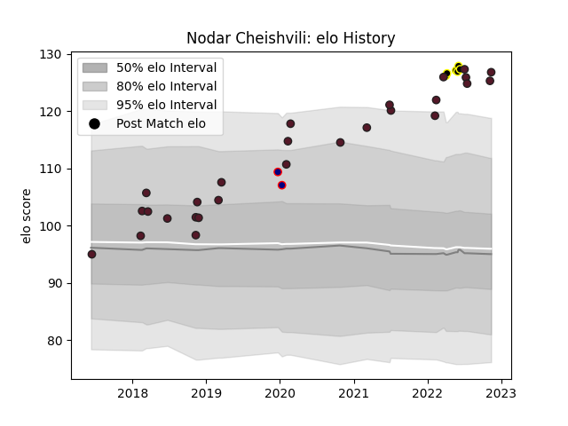

---  
layout: page  
title: Nodar Cheishvili  
date: 2022-11-16 11:24:01.991461  
categories: player  
---
# Nodar Cheishvili

## Positions: L

## Country: Georgia

## Current elo: 127.0

## Current Percentile: 97.0

# Elo History

# Match History

| Team            |   Appearances |   Win Rate |
|:----------------|--------------:|-----------:|
| Georgia         |            27 |   0.722222 |
| Black Lion      |             6 |   0.833333 |
| London Scottish |             2 |   0.5      |

| Opponent               |   Matches |   Win Rate |
|:-----------------------|----------:|-----------:|
| Portugal               |         3 |   0.833333 |
| Belgium                |         3 |   1        |
| Italy                  |         3 |   0.333333 |
| Netherlands            |         2 |   1        |
| Spain                  |         2 |   1        |
| Samoa                  |         2 |   0.5      |
| Russia                 |         2 |   1        |
| Romania                |         2 |   1        |
| Uruguay                |         1 |   1        |
| Tonga                  |         1 |   1        |
| South Africa           |         1 |   0        |
| Scotland               |         1 |   0        |
| SWD Eagles             |         1 |   1        |
| Argentina              |         1 |   0        |
| Bedford                |         1 |   0        |
| Leopards               |         1 |   1        |
| Jersey                 |         1 |   1        |
| Japan                  |         1 |   0        |
| Germany                |         1 |   1        |
| Eastern Province Kings |         1 |   1        |
| Canada                 |         1 |   1        |
| Border Bulldogs        |         1 |   1        |
| Boland Cavaliers       |         1 |   0        |
| Zimbabwe Goshawks      |         1 |   1        |