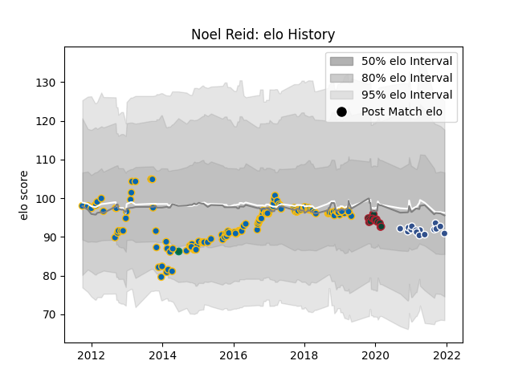

---  
layout: page  
title: Noel Reid  
date: 2023-03-17 17:12:41.358879  
categories: player  
---
# Noel Reid

## Positions: C, FH

## Country: Ireland

## Current elo: 91.0

## Current Percentile: 40.0

# Elo History

# Match History

| Team             |   Appearances |   Win Rate |
|:-----------------|--------------:|-----------:|
| Leinster         |           135 |   0.740741 |
| Leicester Tigers |            17 |   0.5      |
| Agen             |            16 |   0        |
| Ireland          |             1 |   1        |

| Opponent            |   Matches |   Win Rate |
|:--------------------|----------:|-----------:|
| Benetton Treviso    |        16 |   0.8125   |
| Scarlets            |        13 |   0.576923 |
| Dragons             |        12 |   0.75     |
| Connacht            |        11 |   0.727273 |
| Ulster              |        11 |   0.636364 |
| Edinburgh           |        11 |   0.636364 |
| Cardiff Blues       |        10 |   1        |
| Glasgow Warriors    |         9 |   0.555556 |
| Ospreys             |         9 |   0.611111 |
| Zebre               |         8 |   1        |
| Munster             |         6 |   0.666667 |
| Wasps               |         5 |   0.6      |
| Bath Rugby          |         4 |   0.75     |
| Southern Kings      |         4 |   1        |
| Castres Olympique   |         3 |   0.666667 |
| Pau                 |         3 |   0.333333 |
| Harlequins          |         3 |   0.5      |
| London Irish        |         2 |   0        |
| Northampton Saints  |         2 |   0.5      |
| Stade Toulousain    |         2 |   0.5      |
| Worcester Warriors  |         2 |   0.5      |
| Montpellier Herault |         2 |   0.5      |
| Aironi              |         2 |   1        |
| Brive               |         2 |   0        |
| Calvisano           |         2 |   1        |
| La Rochelle         |         1 |   0        |
| Carcassonne         |         1 |   0        |
| Bayonne             |         1 |   0        |
| Bordeaux Begles     |         1 |   0        |
| Bristol Rugby       |         1 |   1        |
| US Bressane         |         1 |   0        |
| Saracens            |         1 |   0        |
| Argentina           |         1 |   1        |
| Sale Sharks         |         1 |   0        |
| Cheetahs            |         1 |   0        |
| Clermont Auvergne   |         1 |   0        |
| Exeter Chiefs       |         1 |   0        |
| Nevers              |         1 |   0        |
| Gloucester Rugby    |         1 |   1        |
| Grenoble            |         1 |   0        |