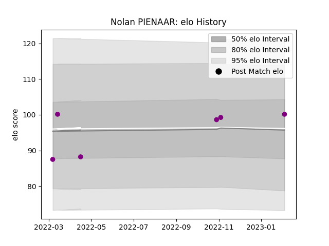

---  
layout: page  
title: Nolan PIENAAR  
date: 2023-02-05 17:57:57.636499  
categories: player  
---
# Nolan PIENAAR

## Positions: P

## Current elo: 100.0

## Current Percentile: 62.0

# Elo History

# Match History

| Team             |   Appearances |   Win Rate |
|:-----------------|--------------:|-----------:|
| Soyaux-Angouleme |             6 |        0.5 |

| Opponent   |   Matches |   Win Rate |
|:-----------|----------:|-----------:|
| Agen       |         1 |          1 |
| Albi       |         1 |          1 |
| Beziers    |         1 |          0 |
| Chambery   |         1 |          0 |
| Colomiers  |         1 |          0 |
| Suresnes   |         1 |          1 |