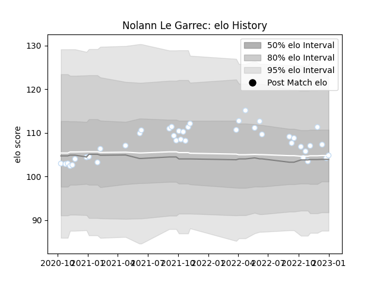

---  
layout: page  
title: Nolann Le Garrec  
date: 2023-01-06 00:10:52.179221  
categories: player  
---
# Nolann Le Garrec

## Positions: SH

## Current elo: 105.0

## Current Percentile: 50.0

# Elo History

# Match History

| Team      |   Appearances |   Win Rate |
|:----------|--------------:|-----------:|
| Racing 92 |            41 |   0.621951 |

| Opponent             |   Matches |   Win Rate |
|:---------------------|----------:|-----------:|
| Stade Francais Paris |         5 |   0.8      |
| Brive                |         4 |   0.75     |
| La Rochelle          |         4 |   0.5      |
| Montpellier Herault  |         4 |   0.5      |
| Castres Olympique    |         3 |   0.5      |
| Clermont Auvergne    |         3 |   0.666667 |
| Stade Toulousain     |         3 |   0.333333 |
| Biarritz Olympique   |         2 |   0.5      |
| Bordeaux Begles      |         2 |   0        |
| Lyon                 |         2 |   1        |
| Pau                  |         2 |   1        |
| Perpignan            |         2 |   1        |
| Toulon               |         2 |   1        |
| Agen                 |         1 |   1        |
| Bayonne              |         1 |   0        |
| Leinster             |         1 |   0        |