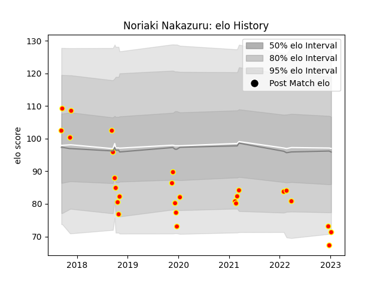

---  
layout: page  
title: Noriaki Nakazuru  
date: 2022-12-28 12:56:12.486823  
categories: player  
---
# Noriaki Nakazuru

## Positions: C

## Current elo: 82.0

## Current Percentile: 9.0

# Elo History

# Match History

| Team          |   Appearances |   Win Rate |
|:--------------|--------------:|-----------:|
| Kyuden Voltex |            26 |   0.346154 |

| Opponent                         |   Matches |   Win Rate |
|:---------------------------------|----------:|-----------:|
| Chugoku Red Regulions            |         4 |   1        |
| Kurita Water Gush                |         3 |   0.333333 |
| Toyota Industries Shuttles Aichi |         3 |   0        |
| Coca-Cola Red Sparks             |         2 |   0        |
| Hanazono Kintetsu Liners         |         2 |   0        |
| Kamaishi Seawaves                |         2 |   0.5      |
| Mitsubishi Dynaboars             |         2 |   0        |
| NTT Docomo Red Hurricanes Osaka  |         2 |   0        |
| Chubu Electric Power             |         1 |   1        |
| Hino Red Dolphins                |         1 |   0        |
| Mazda Blue Zoomers               |         1 |   0        |
| Munakata Sanix Blues             |         1 |   0        |
| Shimizu Blue Sharks              |         1 |   1        |
| Skyactivs Hiroshima              |         1 |   1        |