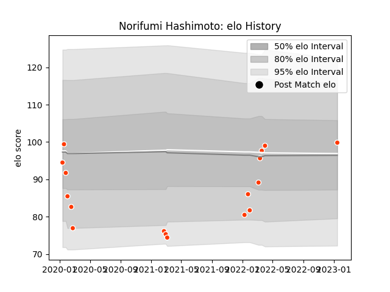

---  
layout: page  
title: Norifumi Hashimoto  
date: 2023-01-17 11:30:12.304318  
categories: player  
---
# Norifumi Hashimoto

## Positions: SH

## Current elo: 100.0

## Current Percentile: 48.0

# Elo History

# Match History

| Team              |   Appearances |   Win Rate |
|:------------------|--------------:|-----------:|
| Hino Red Dolphins |            17 |   0.235294 |

| Opponent                          |   Matches |   Win Rate |
|:----------------------------------|----------:|-----------:|
| Mie Honda Heat                    |         3 |          0 |
| Kamaishi Seawaves                 |         2 |          1 |
| Shizuoka Blue Revs                |         2 |          0 |
| Green Rockets Tokatsu             |         1 |          1 |
| Hanazono Kintetsu Liners          |         1 |          0 |
| Kobelco Kobe Steelers             |         1 |          0 |
| Kubota Spears Funabashi Tokyo-Bay |         1 |          0 |
| Mitsubishi Dynaboars              |         1 |          0 |
| Saitama Wild Knights              |         1 |          0 |
| Skyactivs Hiroshima               |         1 |          1 |
| Tokyo Sungoliath                  |         1 |          0 |
| Toyota Verblitz                   |         1 |          0 |
| Urayasu D-Rocks                   |         1 |          0 |