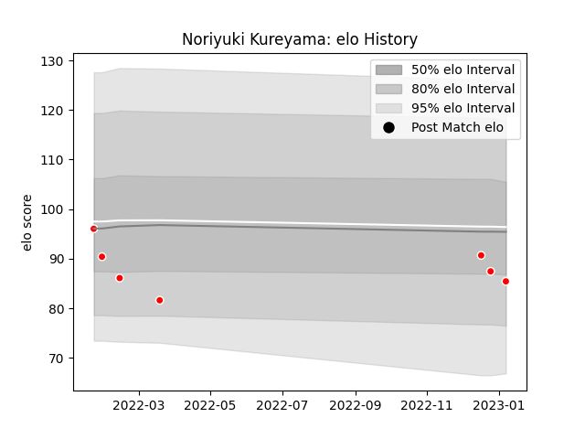

---  
layout: page  
title: Noriyuki Kureyama  
date: 2023-01-13 11:26:47.702243  
categories: player  
---
# Noriyuki Kureyama

## Positions: L, FL

## Current elo: 85.0

## Current Percentile: 26.0

# Elo History

# Match History

| Team                  |   Appearances |   Win Rate |
|:----------------------|--------------:|-----------:|
| Chugoku Red Regulions |             7 |   0.142857 |

| Opponent                         |   Matches |   Win Rate |
|:---------------------------------|----------:|-----------:|
| Kurita Water Gush                |         1 |          0 |
| Kyuden Voltex                    |         1 |          0 |
| Munakata Sanix Blues             |         1 |          0 |
| NTT Docomo Red Hurricanes Osaka  |         1 |          0 |
| Shimizu Blue Sharks              |         1 |          0 |
| Skyactivs Hiroshima              |         1 |          1 |
| Toyota Industries Shuttles Aichi |         1 |          0 |