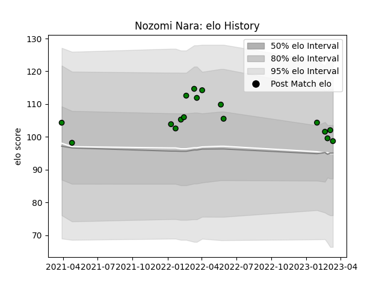

---  
layout: page  
title: Nozomi Nara  
date: 2023-03-17 17:33:48.016727  
categories: player  
---
# Nozomi Nara

## Positions: C, W

## Current elo: 99.0

## Current Percentile: 63.0

# Elo History

# Match History

| Team                 |   Appearances |   Win Rate |
|:---------------------|--------------:|-----------:|
| Mitsubishi Dynaboars |            17 |   0.647059 |

| Opponent                          |   Matches |   Win Rate |
|:----------------------------------|----------:|-----------:|
| Hanazono Kintetsu Liners          |         3 |          1 |
| Hino Red Dolphins                 |         2 |          1 |
| Kubota Spears Funabashi Tokyo-Bay |         2 |          0 |
| Skyactivs Hiroshima               |         2 |          1 |
| Urayasu D-Rocks                   |         2 |          1 |
| Green Rockets Tokatsu             |         1 |          0 |
| Kamaishi Seawaves                 |         1 |          1 |
| Kobelco Kobe Steelers             |         1 |          0 |
| Mie Honda Heat                    |         1 |          1 |
| Tokyo Sungoliath                  |         1 |          0 |
| Yokohama Canon Eagles             |         1 |          0 |