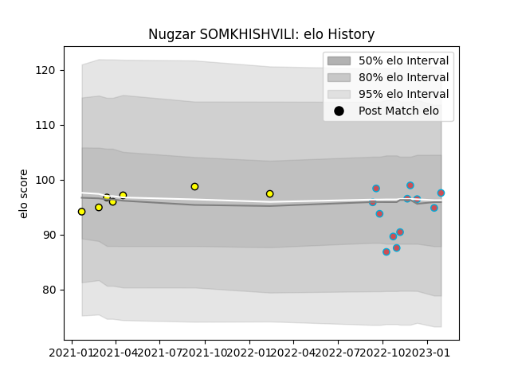

---  
layout: page  
title: Nugzar SOMKHISHVILI  
date: 2023-01-17 11:44:07.997608  
categories: player  
---
# Nugzar SOMKHISHVILI

## Positions: P

## Current elo: 97.0

## Current Percentile: 64.0

# Elo History

# Match History

| Team             |   Appearances |   Win Rate |
|:-----------------|--------------:|-----------:|
| Bourgoin-Jallieu |            11 |   0.590909 |
| Carcassonne      |             7 |   0.428571 |

| Opponent                   |   Matches |   Win Rate |
|:---------------------------|----------:|-----------:|
| Mont-de-Marsan             |         2 |        0   |
| Narbonne                   |         2 |        0.5 |
| US Bressane                |         2 |        0.5 |
| Chambery                   |         1 |        1   |
| Cognac Saint Jean d'Angély |         1 |        1   |
| Dax                        |         1 |        1   |
| Nevers                     |         1 |        1   |
| Nice                       |         1 |        1   |
| Oyonnax                    |         1 |        0   |
| Provence Rugby             |         1 |        1   |
| Rennes                     |         1 |        1   |
| Suresnes                   |         1 |        0   |
| Tarbes                     |         1 |        0   |
| Valence Romans Drome Rugby |         1 |        0.5 |
| Vannes                     |         1 |        0   |