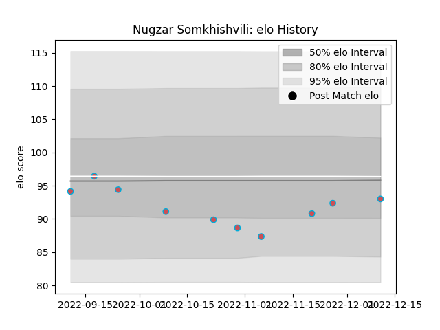

---  
layout: page  
title: Nugzar Somkhishvili  
date: 2022-12-14 11:20:04.982901  
categories: player  
---
# Nugzar Somkhishvili

## Positions: P

## Current elo: 93.0

## Current Percentile: 33.0

# Elo History

# Match History

| Team             |   Appearances |   Win Rate |
|:-----------------|--------------:|-----------:|
| Bourgoin-Jallieu |            10 |       0.65 |

| Opponent                   |   Matches |   Win Rate |
|:---------------------------|----------:|-----------:|
| Chambery                   |         1 |        1   |
| Cognac Saint Jean d'Angély |         1 |        1   |
| Dax                        |         1 |        1   |
| Narbonne                   |         1 |        1   |
| Nice                       |         1 |        1   |
| Rennes                     |         1 |        1   |
| Suresnes                   |         1 |        0   |
| Tarbes                     |         1 |        0   |
| US Bressane                |         1 |        0   |
| Valence Romans Drome Rugby |         1 |        0.5 |