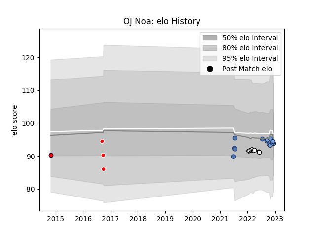

---  
layout: page  
title: OJ Noa  
date: 2022-12-14 11:14:02.941609  
categories: player  
---
# OJ Noa

## Positions: FL, N8

## Country: Samoa

## Current elo: 94.0

## Current Percentile: 42.0

# Elo History

# Match History

| Team             |   Appearances |   Win Rate |
|:-----------------|--------------:|-----------:|
| Bayonne          |             8 |   0.5      |
| Natal Sharks     |             8 |   0.625    |
| Samoa            |             5 |   0.8      |
| Canberra Vikings |             3 |   0.333333 |
| Melbourne Rising |             1 |   0        |

| Opponent             |   Matches |   Win Rate |
|:---------------------|----------:|-----------:|
| Tonga                |         3 |        1   |
| Western Province     |         2 |        0.5 |
| Golden Lions         |         2 |        0.5 |
| Griquas              |         2 |        1   |
| New Zealand Maori    |         1 |        0   |
| Stade Toulousain     |         1 |        1   |
| Stade Francais Paris |         1 |        0   |
| Scarlets             |         1 |        0   |
| Pumas                |         1 |        1   |
| Perth Spirit         |         1 |        0   |
| North Harbour Rays   |         1 |        0   |
| Bordeaux Begles      |         1 |        1   |
| Brisbane City        |         1 |        1   |
| Melbourne Rising     |         1 |        0   |
| Lyon                 |         1 |        1   |
| Free State Cheetahs  |         1 |        0   |
| Fiji                 |         1 |        1   |
| Clermont Auvergne    |         1 |        1   |
| Castres Olympique    |         1 |        0   |
| Montpellier Herault  |         1 |        0   |