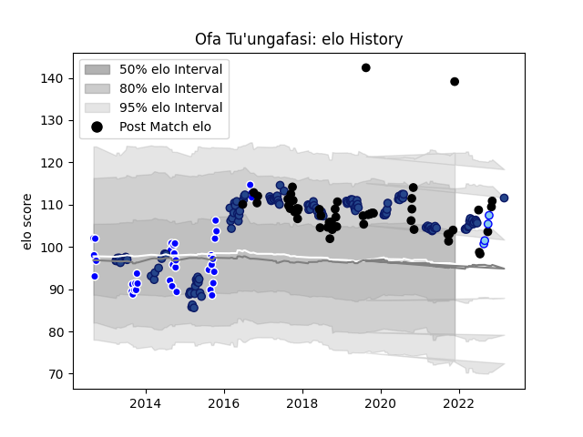

---  
layout: page  
title: Ofa Tu'ungafasi  
date: 2023-03-02 11:21:02.730835  
categories: player  
---
# Ofa Tu'ungafasi

## Positions: P

## Country: New Zealand

## Current elo: 139.0

## Current Percentile: 77.0

# Elo History

# Match History

| Team        |   Appearances |   Win Rate |
|:------------|--------------:|-----------:|
| Blues       |           127 |   0.5      |
| New Zealand |            52 |   0.788462 |
| Auckland    |            38 |   0.631579 |
| Northland   |             4 |   0.75     |

| Opponent                 |   Matches |   Win Rate |
|:-------------------------|----------:|-----------:|
| Chiefs                   |        19 |   0.342105 |
| Highlanders              |        19 |   0.578947 |
| Hurricanes               |        16 |   0.375    |
| Crusaders                |        16 |   0.0625   |
| Australia                |        11 |   0.772727 |
| South Africa             |         8 |   0.6875   |
| Queensland Reds          |         8 |   0.6875   |
| Argentina                |         7 |   1        |
| Ireland                  |         6 |   0.333333 |
| Canterbury               |         6 |   0.166667 |
| Brumbies                 |         6 |   0.833333 |
| Melbourne Rebels         |         6 |   0.666667 |
| France                   |         6 |   0.833333 |
| Stormers                 |         6 |   0.5      |
| New South Wales Waratahs |         6 |   0.833333 |
| Counties Manukau         |         5 |   0.6      |
| Waikato                  |         4 |   0.75     |
| Manawatu                 |         4 |   1        |
| Western Force            |         4 |   1        |
| Bay of Plenty            |         4 |   0.75     |
| Cheetahs                 |         4 |   0.5      |
| Bulls                    |         4 |   0.875    |
| Sharks                   |         3 |   0.333333 |
| Wellington               |         3 |   0.666667 |
| Wales                    |         3 |   1        |
| Tasman                   |         3 |   0.833333 |
| Taranaki                 |         3 |   0.333333 |
| Southland                |         3 |   0.833333 |
| Italy                    |         3 |   1        |
| Northland                |         3 |   1        |
| Lions                    |         3 |   0.333333 |
| Otago                    |         2 |   0.5      |
| Jaguares                 |         2 |   0.5      |
| Sunwolves                |         2 |   0.5      |
| England                  |         2 |   0.5      |
| Japan                    |         2 |   1        |
| Canada                   |         1 |   1        |
| North Harbour            |         1 |   1        |
| Southern Kings           |         1 |   1        |
| Namibia                  |         1 |   1        |
| British and Irish Lions  |         1 |   1        |
| Moana Pasifika           |         1 |   1        |
| Tonga                    |         1 |   1        |
| Hawke's Bay              |         1 |   0        |
| Scotland                 |         1 |   1        |