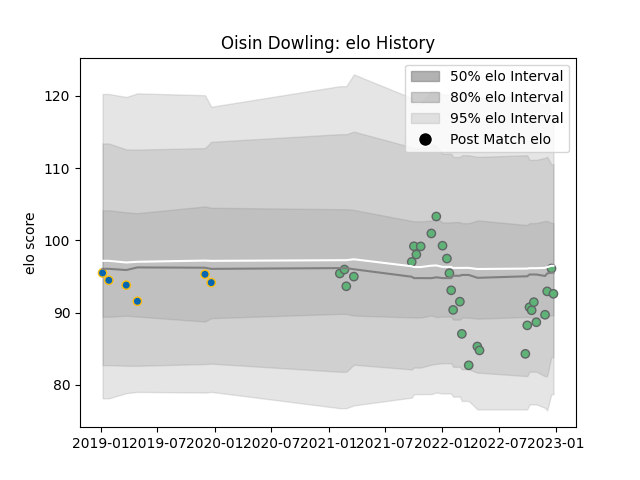

---  
layout: page  
title: Oisin Dowling  
date: 2022-12-12 15:11:15.970853  
categories: player  
---
# Oisin Dowling

## Positions: L

## Current elo: 93.0

## Current Percentile: 23.0

# Elo History

# Match History

| Team     |   Appearances |   Win Rate |
|:---------|--------------:|-----------:|
| Connacht |            28 |   0.5      |
| Leinster |             6 |   0.666667 |

| Opponent             |   Matches |   Win Rate |
|:---------------------|----------:|-----------:|
| Ulster               |         5 |   0.6      |
| Munster              |         3 |   0.666667 |
| Scarlets             |         3 |   0.666667 |
| Benetton Treviso     |         2 |   1        |
| Bulls                |         2 |   0.5      |
| Cardiff Blues        |         2 |   0.5      |
| Dragons              |         2 |   0.5      |
| Edinburgh            |         2 |   0        |
| Glasgow Warriors     |         2 |   0.5      |
| Leinster             |         2 |   0        |
| Ospreys              |         2 |   1        |
| Stade Francais Paris |         2 |   0.5      |
| Stormers             |         2 |   0.5      |
| Leicester Tigers     |         1 |   0        |
| Lions                |         1 |   1        |
| Sharks               |         1 |   0        |