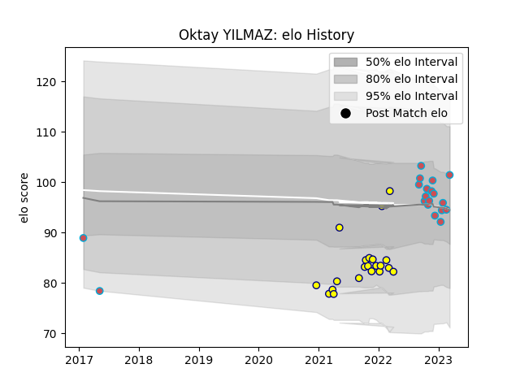

---  
layout: page  
title: Oktay YILMAZ  
date: 2023-01-17 11:44:51.862274  
categories: player  
---
# Oktay YILMAZ

## Positions: P

## Current elo: 91.0

## Current Percentile: 39.0

# Elo History

# Match History

| Team             |   Appearances |   Win Rate |
|:-----------------|--------------:|-----------:|
| Nevers           |            21 |   0.380952 |
| Bourgoin-Jallieu |            15 |   0.433333 |

| Opponent                   |   Matches |   Win Rate |
|:---------------------------|----------:|-----------:|
| Narbonne                   |         4 |       0.75 |
| Montauban                  |         2 |       0.5  |
| Colomiers                  |         2 |       0.5  |
| Valence Romans Drome Rugby |         2 |       0.25 |
| US Bressane                |         2 |       0.5  |
| Rouen                      |         2 |       0.5  |
| Mont-de-Marsan             |         2 |       0.5  |
| Vannes                     |         2 |       0    |
| Aurillac                   |         2 |       0.5  |
| Cognac Saint Jean d'Angély |         1 |       1    |
| Provence Rugby             |         1 |       0    |
| Biarritz Olympique         |         1 |       0    |
| Tarbes                     |         1 |       0    |
| Suresnes                   |         1 |       0    |
| Blagnac                    |         1 |       0    |
| Rennes                     |         1 |       1    |
| Perpignan                  |         1 |       0    |
| Chambery                   |         1 |       1    |
| Oyonnax                    |         1 |       0    |
| Nice                       |         1 |       1    |
| Carcassonne                |         1 |       0    |
| Albi                       |         1 |       0    |
| Carqueiranne-Hyères        |         1 |       1    |
| Grenoble                   |         1 |       0    |
| Agen                       |         1 |       0    |