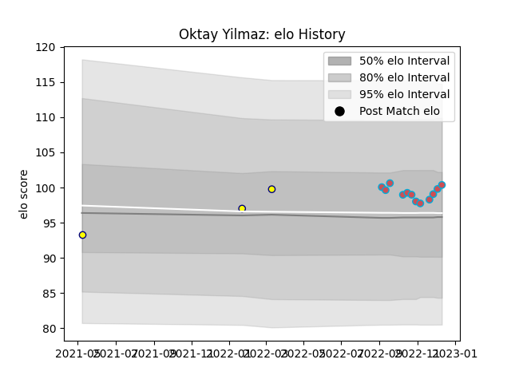

---  
layout: page  
title: Oktay Yilmaz  
date: 2022-12-18 16:23:17.824762  
categories: player  
---
# Oktay Yilmaz

## Positions: P

## Current elo: 100.0

## Current Percentile: 67.0

# Elo History

# Match History

| Team             |   Appearances |   Win Rate |
|:-----------------|--------------:|-----------:|
| Bourgoin-Jallieu |            12 |   0.541667 |
| Nevers           |             3 |   0.333333 |

| Opponent                   |   Matches |   Win Rate |
|:---------------------------|----------:|-----------:|
| Narbonne                   |         2 |       1    |
| Valence Romans Drome Rugby |         2 |       0.25 |
| Albi                       |         1 |       0    |
| Blagnac                    |         1 |       0    |
| Carqueiranne-Hyères        |         1 |       1    |
| Chambery                   |         1 |       1    |
| Cognac Saint Jean d'Angély |         1 |       1    |
| Nice                       |         1 |       1    |
| Oyonnax                    |         1 |       0    |
| Rennes                     |         1 |       1    |
| Suresnes                   |         1 |       0    |
| Tarbes                     |         1 |       0    |
| US Bressane                |         1 |       0    |