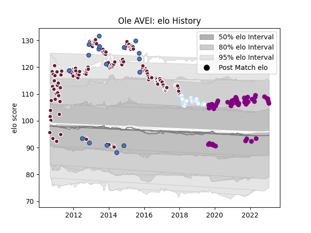

---  
layout: page  
title: Ole AVEI  
date: 2023-02-04 18:26:24.596984  
categories: player  
---
# Ole AVEI

## Positions: H

## Country: Samoa

## Current elo: 133.0

## Current Percentile: 98.0

# Elo History

# Match History

| Team             |   Appearances |   Win Rate |
|:-----------------|--------------:|-----------:|
| Bordeaux Begles  |           175 |   0.514286 |
| Soyaux-Angouleme |            56 |   0.517857 |
| Racing 92        |            29 |   0.586207 |
| Samoa            |            18 |   0.444444 |

| Opponent                   |   Matches |   Win Rate |
|:---------------------------|----------:|-----------:|
| Grenoble                   |        16 |   0.59375  |
| Clermont Auvergne          |        14 |   0.321429 |
| Stade Toulousain           |        12 |   0.291667 |
| Toulon                     |        12 |   0.416667 |
| Brive                      |        11 |   0.772727 |
| Castres Olympique          |        11 |   0.454545 |
| Lyon                       |        10 |   0.5      |
| Montpellier Herault        |        10 |   0.2      |
| Bayonne                    |        10 |   0.6      |
| Stade Francais Paris       |        10 |   0.5      |
| Racing 92                  |         9 |   0.333333 |
| La Rochelle                |         8 |   0.375    |
| Perpignan                  |         8 |   0.5      |
| Pau                        |         8 |   0.5      |
| Mont-de-Marsan             |         7 |   0.714286 |
| Agen                       |         7 |   0.714286 |
| Colomiers                  |         6 |   0.5      |
| Biarritz Olympique         |         6 |   0.5      |
| Aurillac                   |         5 |   0.6      |
| Oyonnax                    |         5 |   0.4      |
| Rouen                      |         4 |   0.5      |
| Exeter Chiefs              |         4 |   0.5      |
| Carcassonne                |         4 |   0.375    |
| Montauban                  |         4 |   0.375    |
| Albi                       |         4 |   0.75     |
| Nevers                     |         3 |   0.333333 |
| Tarbes                     |         3 |   0.333333 |
| Valence Romans Drome Rugby |         3 |   1        |
| Dax                        |         3 |   1        |
| Beziers                    |         3 |   0.333333 |
| South Africa               |         3 |   0        |
| Italy                      |         3 |   0.666667 |
| Provence Rugby             |         3 |   1        |
| Narbonne                   |         2 |   1        |
| Newcastle Falcons          |         2 |   0        |
| Nice                       |         2 |   0.5      |
| RC Enisei                  |         2 |   1        |
| Saint-Etienne              |         2 |   1        |
| Leicester Tigers           |         2 |   1        |
| Scotland                   |         2 |   0.5      |
| Enisey-STM Krasnoyarsk     |         2 |   1        |
| Dijon                      |         2 |   0.5      |
| United States of America   |         2 |   1        |
| Canada                     |         2 |   1        |
| Bordeaux Begles            |         2 |   0.5      |
| Blagnac                    |         2 |   1        |
| Vannes                     |         2 |   0.5      |
| Roval Drome XV             |         1 |   0        |
| Ulster                     |         1 |   1        |
| Wales                      |         1 |   1        |
| Suresnes                   |         1 |   1        |
| Leinster                   |         1 |   0        |
| Ospreys                    |         1 |   1        |
| New Zealand                |         1 |   0        |
| Massy                      |         1 |   0        |
| Japan                      |         1 |   0        |
| Ireland                    |         1 |   0        |
| Gloucester Rugby           |         1 |   1        |
| Georgia                    |         1 |   0        |
| France                     |         1 |   0        |
| Edinburgh                  |         1 |   0        |
| Dragons                    |         1 |   1        |
| Cognac Saint Jean d'Angély |         1 |   1        |
| Chambery                   |         1 |   0        |
| Bourgoin-Jallieu           |         1 |   1        |
| Auch                       |         1 |   1        |
| Aubenas                    |         1 |   1        |
| Wasps                      |         1 |   0        |