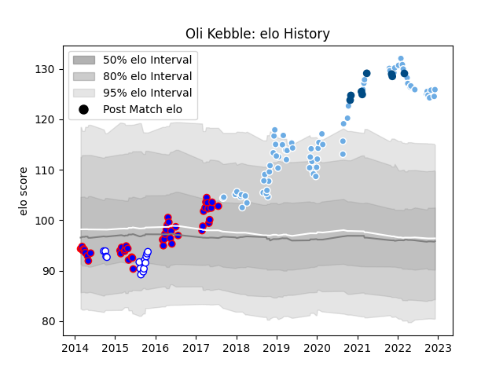

---  
layout: page  
title: Oli Kebble  
date: 2022-12-12 15:17:12.124217  
categories: player  
---
# Oli Kebble

## Positions: P

## Country: Scotland

## Current elo: 126.0

## Current Percentile: 98.0

# Elo History

# Match History

| Team             |   Appearances |   Win Rate |
|:-----------------|--------------:|-----------:|
| Glasgow Warriors |            74 |   0.581081 |
| Stormers         |            47 |   0.510638 |
| Western Province |            14 |   0.714286 |
| Scotland         |             8 |   0.625    |

| Opponent                 |   Matches |   Win Rate |
|:-------------------------|----------:|-----------:|
| Zebre                    |        10 |   1        |
| Cheetahs                 |        10 |   0.8      |
| Edinburgh                |         8 |   0.25     |
| Leinster                 |         6 |   0        |
| Lions                    |         5 |   0.3      |
| Dragons                  |         5 |   0.7      |
| Connacht                 |         5 |   0.8      |
| Benetton Treviso         |         5 |   0.6      |
| Bulls                    |         5 |   0.6      |
| Chiefs                   |         4 |   0.25     |
| Cardiff Blues            |         4 |   0.75     |
| Scarlets                 |         4 |   0.5      |
| Ospreys                  |         4 |   0.75     |
| Munster                  |         4 |   0.5      |
| Blue Bulls               |         4 |   0.75     |
| Sharks                   |         4 |   0        |
| Highlanders              |         3 |   0.333333 |
| Sunwolves                |         3 |   0.833333 |
| Saracens                 |         3 |   0        |
| New South Wales Waratahs |         3 |   0.333333 |
| Ulster                   |         3 |   0.666667 |
| Hurricanes               |         3 |   0.333333 |
| Griquas                  |         2 |   1        |
| Exeter Chiefs            |         2 |   0.25     |
| Wales                    |         2 |   0.5      |
| Blues                    |         2 |   1        |
| Brumbies                 |         2 |   0.5      |
| Southern Kings           |         2 |   1        |
| Crusaders                |         2 |   0        |
| Sale Sharks              |         2 |   1        |
| Jaguares                 |         2 |   1        |
| Queensland Reds          |         2 |   0.5      |
| France                   |         2 |   0.5      |
| Natal Sharks             |         2 |   0.5      |
| Free State Cheetahs      |         2 |   1        |
| Lyon                     |         2 |   1        |
| Golden Lions             |         2 |   0        |
| Pumas                    |         1 |   1        |
| England                  |         1 |   1        |
| Eastern Province Kings   |         1 |   1        |
| South Africa             |         1 |   0        |
| Melbourne Rebels         |         1 |   1        |
| Stormers                 |         1 |   0        |
| Georgia                  |         1 |   1        |
| Australia                |         1 |   1        |