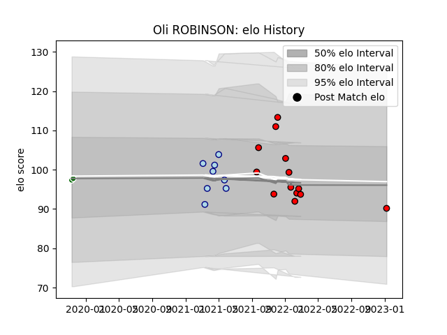

---  
layout: page  
title: Oli ROBINSON  
date: 2023-01-31 10:54:37.143318  
categories: player  
---
# Oli ROBINSON

## Positions: N8, FL

## Current elo: 89.0

## Current Percentile: 44.0

# Elo History

# Match History

| Team                |   Appearances |   Win Rate |
|:--------------------|--------------:|-----------:|
| Hartpury College    |            15 |   0.433333 |
| Bedford             |             8 |   0.375    |
| Ealing Trailfinders |             2 |   1        |

| Opponent            |   Matches |   Win Rate |
|:--------------------|----------:|-----------:|
| Doncaster           |         5 |   0.4      |
| Ampthill            |         3 |   0.666667 |
| Ealing Trailfinders |         3 |   0        |
| Cornish Pirates     |         2 |   0.5      |
| Coventry            |         2 |   0        |
| London Scottish     |         2 |   0.75     |
| Nottingham          |         2 |   0.5      |
| Richmond            |         2 |   1        |
| Hartpury College    |         1 |   1        |
| Jersey              |         1 |   0        |
| Saracens            |         1 |   0        |
| Yorkshire Carnegie  |         1 |   1        |