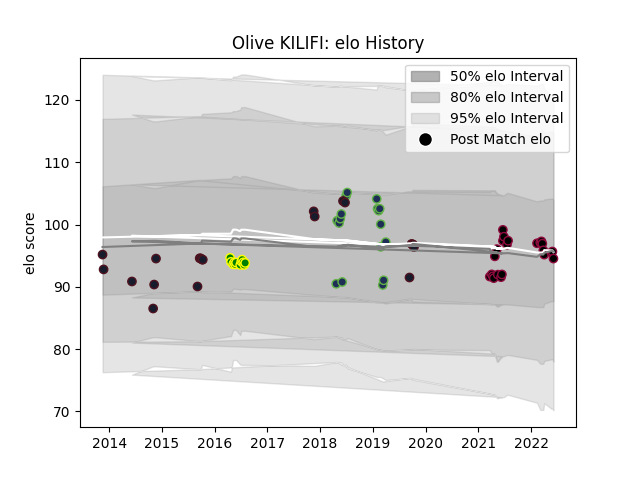

---  
layout: page  
title: Olive KILIFI  
date: 2023-03-29 11:30:20.938021  
categories: player  
---
# Olive KILIFI

Last updated: 2023-03-29
## Positions: P

## Country: United States of America

## Current elo: 95.0

## Current Percentile: 48.0

# Elo History

# Match History

| Team                     |   Appearances |   Win Rate |
|:-------------------------|--------------:|-----------:|
| Utah Warriors            |            23 |   0.565217 |
| United States of America |            20 |   0.35     |
| Seattle Seawolves        |            17 |   0.764706 |
| Sacramento               |            12 |   0.25     |

| Opponent               |   Matches |   Win Rate |
|:-----------------------|----------:|-----------:|
| San Diego Legion       |         7 |   0.428571 |
| L. A. Giltinis         |         5 |   0.4      |
| Houston SaberCats      |         5 |   0.8      |
| Glendale Raptors       |         3 |   0.666667 |
| Ohio                   |         3 |   0        |
| NOLA Gold              |         3 |   0.666667 |
| Denver                 |         3 |   0        |
| Seattle Seawolves      |         3 |   0.333333 |
| San Diego              |         3 |   0.333333 |
| San Francisco          |         3 |   0.666667 |
| Georgia                |         2 |   0.5      |
| Rugby New York         |         2 |   1        |
| Russia                 |         2 |   1        |
| R.U. New York          |         2 |   1        |
| Scotland               |         2 |   0        |
| Dallas Jackals         |         2 |   1        |
| Canada                 |         2 |   1        |
| Toronto Arrows         |         2 |   0.5      |
| Romania                |         1 |   1        |
| Samoa                  |         1 |   0        |
| South Africa           |         1 |   0        |
| Tonga                  |         1 |   0        |
| Argentina              |         1 |   0        |
| New England Free Jacks |         1 |   0        |
| Old Glory DC           |         1 |   1        |
| New Zealand            |         1 |   0        |
| Austin Elite Rugby     |         1 |   1        |
| Japan                  |         1 |   0        |
| Germany                |         1 |   1        |
| France                 |         1 |   0        |
| Fiji                   |         1 |   0        |
| England                |         1 |   0        |
| Australia              |         1 |   0        |
| Austin Herd            |         1 |   1        |
| Austin Gilgronis       |         1 |   1        |
| Utah Warriors          |         1 |   1        |