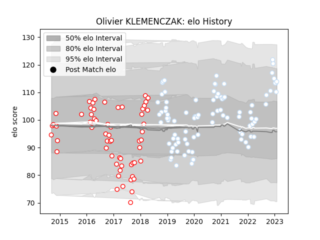

---  
layout: page  
title: Olivier KLEMENCZAK  
date: 2023-03-12 11:34:05.176140  
categories: player  
---
# Olivier KLEMENCZAK

## Positions: C

## Current elo: 112.0

## Current Percentile: 83.0

# Elo History

# Match History

| Team      |   Appearances |   Win Rate |
|:----------|--------------:|-----------:|
| Racing 92 |            89 |   0.623596 |
| Dax       |            59 |   0.355932 |

| Opponent             |   Matches |   Win Rate |
|:---------------------|----------:|-----------:|
| La Rochelle          |         9 |  0.444444  |
| Castres Olympique    |         8 |  0.625     |
| Lyon                 |         8 |  0.375     |
| Perpignan            |         8 |  0.625     |
| Clermont Auvergne    |         7 |  0.785714  |
| Bayonne              |         6 |  0.0833333 |
| Toulon               |         6 |  0.666667  |
| Stade Toulousain     |         6 |  0.333333  |
| Montpellier Herault  |         5 |  1         |
| Narbonne             |         5 |  0.6       |
| Pau                  |         5 |  0.6       |
| Agen                 |         5 |  0.4       |
| Bordeaux Begles      |         5 |  0.4       |
| Colomiers            |         4 |  0.25      |
| Mont-de-Marsan       |         4 |  0.25      |
| Biarritz Olympique   |         4 |  0.5       |
| Aurillac             |         4 |  0.5       |
| Soyaux-Angouleme     |         3 |  0.333333  |
| Stade Francais Paris |         3 |  0.666667  |
| Montauban            |         3 |  0.333333  |
| Massy                |         3 |  0.333333  |
| Albi                 |         3 |  0.166667  |
| Bourgoin-Jallieu     |         3 |  0         |
| Brive                |         3 |  1         |
| Carcassonne          |         3 |  0.333333  |
| Grenoble             |         3 |  0.666667  |
| Saracens             |         2 |  0.5       |
| Ulster               |         2 |  0.5       |
| Beziers              |         2 |  0.5       |
| Scarlets             |         2 |  1         |
| Vannes               |         2 |  1         |
| Oyonnax              |         2 |  0.5       |
| Ospreys              |         2 |  1         |
| Nevers               |         2 |  0.5       |
| Leicester Tigers     |         2 |  1         |
| Leinster             |         1 |  0         |
| Exeter Chiefs        |         1 |  0         |
| Munster              |         1 |  1         |
| Provence Rugby       |         1 |  1         |