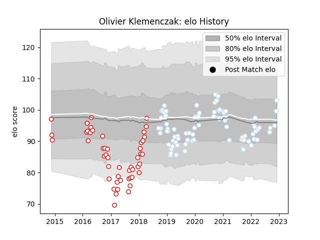

---  
layout: page  
title: Olivier Klemenczak  
date: 2022-12-14 11:25:46.343159  
categories: player  
---
# Olivier Klemenczak

## Positions: C

## Current elo: 102.0

## Current Percentile: 73.0

# Elo History

# Match History

| Team      |   Appearances |   Win Rate |
|:----------|--------------:|-----------:|
| Racing 92 |            86 |   0.633721 |
| Dax       |            49 |   0.367347 |

| Opponent             |   Matches |   Win Rate |
|:---------------------|----------:|-----------:|
| La Rochelle          |         9 |   0.444444 |
| Lyon                 |         8 |   0.375    |
| Castres Olympique    |         8 |   0.625    |
| Perpignan            |         7 |   0.571429 |
| Clermont Auvergne    |         7 |   0.785714 |
| Stade Toulousain     |         6 |   0.333333 |
| Montpellier Herault  |         5 |   1        |
| Narbonne             |         5 |   0.6      |
| Agen                 |         5 |   0.4      |
| Bayonne              |         5 |   0.1      |
| Bordeaux Begles      |         4 |   0.5      |
| Pau                  |         4 |   0.75     |
| Biarritz Olympique   |         4 |   0.5      |
| Toulon               |         4 |   0.75     |
| Soyaux-Angouleme     |         3 |   0.333333 |
| Stade Francais Paris |         3 |   0.666667 |
| Montauban            |         3 |   0.333333 |
| Albi                 |         3 |   0.166667 |
| Massy                |         3 |   0.333333 |
| Carcassonne          |         3 |   0.333333 |
| Colomiers            |         3 |   0.333333 |
| Grenoble             |         3 |   0.666667 |
| Aurillac             |         3 |   0.333333 |
| Brive                |         3 |   1        |
| Ulster               |         2 |   0.5      |
| Scarlets             |         2 |   1        |
| Saracens             |         2 |   0.5      |
| Mont-de-Marsan       |         2 |   0        |
| Vannes               |         2 |   1        |
| Oyonnax              |         2 |   0.5      |
| Ospreys              |         2 |   1        |
| Nevers               |         2 |   0.5      |
| Leicester Tigers     |         2 |   1        |
| Provence Rugby       |         1 |   1        |
| Exeter Chiefs        |         1 |   0        |
| Bourgoin-Jallieu     |         1 |   0        |
| Beziers              |         1 |   1        |
| Munster              |         1 |   1        |
| Leinster             |         1 |   0        |