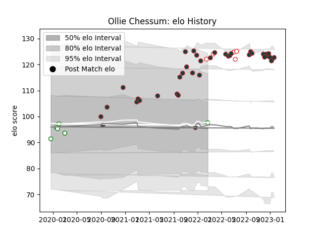

---  
layout: page  
title: Ollie Chessum  
date: 2023-01-06 00:20:29.376706  
categories: player  
---
# Ollie Chessum

## Positions: L, FL

## Country: England

## Current elo: 105.0

## Current Percentile: 79.0

# Elo History

# Match History

| Team             |   Appearances |   Win Rate |
|:-----------------|--------------:|-----------:|
| Leicester Tigers |            35 |   0.757143 |
| Nottingham       |             6 |   0.333333 |
| England          |             5 |   0.6      |

| Opponent           |   Matches |   Win Rate |
|:-------------------|----------:|-----------:|
| Gloucester Rugby   |         4 |   0.75     |
| Wasps              |         4 |   0.5      |
| Saracens           |         4 |   0.5      |
| Bristol Rugby      |         4 |   0.375    |
| Newcastle Falcons  |         3 |   0.666667 |
| Northampton Saints |         3 |   1        |
| Australia          |         3 |   0.666667 |
| Connacht           |         2 |   1        |
| Exeter Chiefs      |         2 |   1        |
| London Irish       |         2 |   1        |
| Cornish Pirates    |         1 |   0        |
| Worcester Warriors |         1 |   1        |
| Bayonne            |         1 |   1        |
| Bordeaux Begles    |         1 |   1        |
| Sale Sharks        |         1 |   0        |
| Ospreys            |         1 |   1        |
| Clermont Auvergne  |         1 |   1        |
| London Scottish    |         1 |   1        |
| Coventry           |         1 |   0        |
| Italy              |         1 |   1        |
| Harlequins         |         1 |   1        |
| Bath Rugby         |         1 |   1        |
| France             |         1 |   0        |
| Doncaster          |         1 |   0        |
| Yorkshire Carnegie |         1 |   1        |