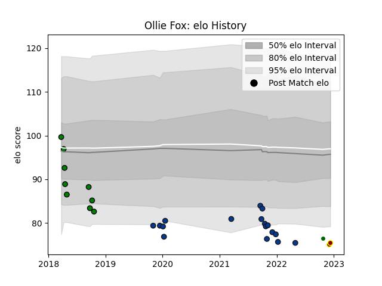

---  
layout: page  
title: Ollie Fox  
date: 2022-12-14 11:17:50.295193  
categories: player  
---
# Ollie Fox

## Positions: SH

## Current elo: 75.0

## Current Percentile: 3.0

# Elo History

# Match History

| Team                |   Appearances |   Win Rate |
|:--------------------|--------------:|-----------:|
| Bath Rugby          |            17 |   0.117647 |
| Yorkshire Carnegie  |             9 |   0.277778 |
| Ampthill            |             2 |   0.25     |
| Ealing Trailfinders |             1 |   1        |

| Opponent            |   Matches |   Win Rate |
|:--------------------|----------:|-----------:|
| Gloucester Rugby    |         3 |   0        |
| London Scottish     |         3 |   0.666667 |
| Newcastle Falcons   |         2 |   0.5      |
| Wasps               |         2 |   0        |
| Ealing Trailfinders |         2 |   0.25     |
| Harlequins          |         2 |   0        |
| Bristol Rugby       |         2 |   0        |
| Richmond            |         1 |   0.5      |
| Ulster              |         1 |   0        |
| Saracens            |         1 |   0        |
| Sale Sharks         |         1 |   0        |
| Rotherham Titans    |         1 |   0        |
| Bedford             |         1 |   0        |
| Nottingham          |         1 |   0        |
| Northampton Saints  |         1 |   0        |
| Leicester Tigers    |         1 |   0        |
| Jersey              |         1 |   1        |
| Hartpury College    |         1 |   0        |
| Clermont Auvergne   |         1 |   0        |
| Worcester Warriors  |         1 |   1        |